# 🏗️ Plan d'Implémentation: Human Body Educational App

## 📋 Vue d'Ensemble

Ce plan détaille la construction complète de l'application éducative 3D du corps humain, de la configuration initiale au déploiement en production.

---

## 🎯 Architecture du Système


---

## 📦 Structure du Monorepo

```
human-body-app/
├── packages/
│   ├── web/                    # Application web
│   │   ├── src/
│   │   │   ├── components/
│   │   │   │   ├── 3d/         # Composants Three.js
│   │   │   │   │   ├── BodyViewer.tsx
│   │   │   │   │   ├── OrganModel.tsx
│   │   │   │   │   ├── CameraControls.tsx
│   │   │   │   │   ├── SystemLayer.tsx
│   │   │   │   │   ├── MultiScaleViewer.tsx
│   │   │   │   │   └── Lighting.tsx
│   │   │   │   ├── ui/         # Composants UI
│   │   │   │   │   ├── Header.tsx
│   │   │   │   │   ├── Sidebar.tsx
│   │   │   │   │   ├── InfoPanel.tsx
│   │   │   │   │   ├── SearchBar.tsx
│   │   │   │   │   ├── ThemeToggle.tsx
│   │   │   │   │   └── LoadingSpinner.tsx
│   │   │   │   └── shared/     # Composants partagés
│   │   │   ├── hooks/
│   │   │   │   ├── useOrganSelection.ts
│   │   │   │   ├── useCameraControls.ts
│   │   │   │   └── useTheme.ts
│   │   │   ├── store/
│   │   │   │   └── useAppStore.ts
│   │   │   ├── services/
│   │   │   │   └── organService.ts
│   │   │   ├── lib/
│   │   │   │   └── api.ts
│   │   │   ├── pages/
│   │   │   │   ├── Home.tsx
│   │   │   │   ├── Explore.tsx
│   │   │   │   └── Quiz.tsx
│   │   │   ├── App.tsx
│   │   │   └── main.tsx
│   │   ├── public/
│   │   │   └── models/
│   │   │       ├── organs/
│   │   │       ├── systems/
│   │   │       ├── cells/
│   │   │       ├── neurons/
│   │   │       └── atoms/
│   │   ├── package.json
│   │   ├── tsconfig.json
│   │   ├── tailwind.config.js
│   │   └── vite.config.ts
│   │
│   ├── mobile/                 # Application mobile
│   │   ├── src/
│   │   │   ├── components/
│   │   │   │   ├── 3d/
│   │   │   │   ├── ui/
│   │   │   │   └── shared/
│   │   │   ├── screens/
│   │   │   │   ├── HomeScreen.tsx
│   │   │   │   ├── ExploreScreen.tsx
│   │   │   │   └── QuizScreen.tsx
│   │   │   ├── navigation/
│   │   │   │   └── AppNavigator.tsx
│   │   │   └── App.tsx
│   │   ├── package.json
│   │   ├── tsconfig.json
│   │   └── app.json
│   │
│   ├── desktop/                # Application desktop
│   │   ├── src/
│   │   │   ├── main/
│   │   │   │   └── index.ts
│   │   │   └── renderer/
│   │   │       ├── components/
│   │   │       ├── store/
│   │   │       └── App.tsx
│   │   ├── package.json
│   │   ├── tsconfig.json
│   │   └── electron-builder.yml
│   │
│   ├── shared/                 # Code partagé
│   │   ├── src/
│   │   │   ├── types/
│   │   │   │   ├── organ.types.ts
│   │   │   │   ├── system.types.ts
│   │   │   │   └── user.types.ts
│   │   │   ├── constants/
│   │   │   │   ├── bodySystems.ts
│   │   │   │   └── viewModes.ts
│   │   │   ├── data/
│   │   │   │   ├── organs.ts
│   │   │   │   └── bodySystems.ts
│   │   │   └── utils/
│   │   │       └── helpers.ts
│   │   ├── package.json
│   │   └── tsconfig.json
│   │
│   └── backend/                # API Backend
│       ├── src/
│       │   ├── routes/
│       │   │   ├── organs.ts
│       │   │   ├── users.ts
│       │   │   ├── auth.ts
│       │   │   └── quiz.ts
│       │   ├── controllers/
│       │   │   ├── organController.ts
│       │   │   ├── userController.ts
│       │   │   └── quizController.ts
│       │   ├── models/
│       │   │   ├── Organ.ts
│       │   │   ├── User.ts
│       │   │   └── UserProgress.ts
│       │   ├── middleware/
│       │   │   ├── auth.ts
│       │   │   └── errorHandler.ts
│       │   ├── services/
│       │   │   ├── organService.ts
│       │   │   ├── authService.ts
│       │   │   └── stripeService.ts
│       │   ├── config/
│       │   │   ├── database.ts
│       │   │   └── redis.ts
│       │   ├── migrations/
│       │   ├── seeds/
│       │   └── server.ts
│       ├── package.json
│       └── tsconfig.json
│
├── docs/                       # Documentation
├── plans/                      # Plans d'implémentation
├── .gitignore
├── package.json                # Root package.json
├── turbo.json                  # Turbo configuration
├── .prettierrc
├── .eslintrc.js
└── README.md
```

---

## 🚀 Phase 1: Configuration de l'Environnement

### 1.1 Initialisation du Monorepo

```bash
# Le package.json root existe déjà avec workspaces configurés
# Vérifier que tous les packages sont créés
```

### 1.2 Création des Packages

#### Package Shared
```json
// packages/shared/package.json
{
  "name": "@human-body/shared",
  "version": "1.0.0",
  "main": "dist/index.js",
  "types": "dist/index.d.ts",
  "scripts": {
    "build": "tsc",
    "dev": "tsc --watch"
  },
  "dependencies": {},
  "devDependencies": {
    "typescript": "^5.3.0"
  }
}
```

#### Package Web
```json
// packages/web/package.json
{
  "name": "@human-body/web",
  "version": "1.0.0",
  "scripts": {
    "dev": "vite",
    "build": "tsc && vite build",
    "preview": "vite preview",
    "lint": "eslint src --ext ts,tsx",
    "test": "vitest"
  },
  "dependencies": {
    "react": "^18.2.0",
    "react-dom": "^18.2.0",
    "three": "^0.160.0",
    "@react-three/fiber": "^8.15.0",
    "@react-three/drei": "^9.96.0",
    "zustand": "^4.4.0",
    "@tanstack/react-query": "^5.17.0",
    "framer-motion": "^10.18.0",
    "lucide-react": "^0.303.0",
    "axios": "^1.6.0",
    "react-router-dom": "^6.21.0",
    "@human-body/shared": "*"
  },
  "devDependencies": {
    "@types/react": "^18.2.0",
    "@types/react-dom": "^18.2.0",
    "@types/three": "^0.160.0",
    "typescript": "^5.3.0",
    "vite": "^5.0.0",
    "tailwindcss": "^3.4.0",
    "autoprefixer": "^10.4.0",
    "postcss": "^8.4.0",
    "eslint": "^8.56.0",
    "prettier": "^3.1.0",
    "vitest": "^1.0.0",
    "@testing-library/react": "^14.1.0"
  }
}
```

#### Package Mobile
```json
// packages/mobile/package.json
{
  "name": "@human-body/mobile",
  "version": "1.0.0",
  "scripts": {
    "start": "expo start",
    "android": "expo start --android",
    "ios": "expo start --ios",
    "build:ios": "eas build --platform ios",
    "build:android": "eas build --platform android"
  },
  "dependencies": {
    "react": "18.2.0",
    "react-native": "0.73.0",
    "expo": "~50.0.0",
    "three": "^0.160.0",
    "@react-three/fiber": "^8.15.0",
    "@react-three/drei": "^9.96.0",
    "react-native-reanimated": "^3.6.0",
    "react-native-gesture-handler": "^2.14.0",
    "@react-navigation/native": "^6.1.0",
    "@react-navigation/native-stack": "^6.9.0",
    "@human-body/shared": "*"
  },
  "devDependencies": {
    "@types/react": "^18.2.0",
    "@types/react-native": "^0.73.0",
    "typescript": "^5.3.0",
    "@expo/webpack-config": "^19.0.0"
  }
}
```

#### Package Desktop
```json
// packages/desktop/package.json
{
  "name": "@human-body/desktop",
  "version": "1.0.0",
  "scripts": {
    "dev": "vite",
    "build": "tsc && vite build && electron-builder",
    "build:win": "electron-builder --win",
    "build:mac": "electron-builder --mac",
    "build:linux": "electron-builder --linux"
  },
  "dependencies": {
    "react": "^18.2.0",
    "react-dom": "^18.2.0",
    "three": "^0.160.0",
    "@react-three/fiber": "^8.15.0",
    "@react-three/drei": "^9.96.0",
    "electron": "^28.0.0",
    "electron-store": "^8.1.0",
    "@human-body/shared": "*"
  },
  "devDependencies": {
    "@types/react": "^18.2.0",
    "@types/react-dom": "^18.2.0",
    "typescript": "^5.3.0",
    "vite": "^5.0.0",
    "vite-plugin-electron": "^0.28.0",
    "electron-builder": "^24.9.0"
  }
}
```

#### Package Backend
```json
// packages/backend/package.json
{
  "name": "@human-body/backend",
  "version": "1.0.0",
  "scripts": {
    "dev": "nodemon src/server.ts",
    "build": "tsc",
    "start": "node dist/server.js",
    "migrate": "node dist/migrations/run.js",
    "seed": "node dist/seeds/run.js",
    "test": "jest"
  },
  "dependencies": {
    "express": "^4.18.0",
    "cors": "^2.8.5",
    "helmet": "^7.1.0",
    "dotenv": "^16.3.0",
    "pg": "^8.11.0",
    "redis": "^4.6.0",
    "jsonwebtoken": "^9.0.0",
    "bcrypt": "^5.1.0",
    "joi": "^17.11.0",
    "stripe": "^14.10.0",
    "multer": "^1.4.5",
    "aws-sdk": "^2.1500.0"
  },
  "devDependencies": {
    "@types/express": "^4.17.0",
    "@types/node": "^20.10.0",
    "@types/cors": "^2.8.0",
    "@types/bcrypt": "^5.0.0",
    "@types/jsonwebtoken": "^9.0.0",
    "typescript": "^5.3.0",
    "nodemon": "^3.0.0",
    "ts-node": "^10.9.0",
    "jest": "^29.7.0",
    "@types/jest": "^29.5.0"
  }
}
```

---

## 📦 Phase 2: Package Shared (Fondations)

### 2.1 Types TypeScript

```typescript
// packages/shared/src/types/organ.types.ts
export interface Organ {
  id: string;
  name: string;
  system: string;
  location: string;
  function: string;
  position: { x: number; y: number; z: number };
  modelPath: string;
  info: {
    description: string;
    size: string;
    weight: string;
    facts: string[];
  };
  relatedOrgans: string[];
}

export interface OrganSelection {
  organId: string | null;
  timestamp: number;
}

export interface OrganHighlight {
  organId: string;
  color: string;
  intensity: number;
}
```

```typescript
// packages/shared/src/types/system.types.ts
export interface BodySystem {
  id: string;
  name: string;
  description: string;
  color: string;
  modelPath: string;
  organs: string[];
}

export type SystemId = 
  | 'skeletal' 
  | 'muscular' 
  | 'nervous' 
  | 'circulatory' 
  | 'digestive' 
  | 'respiratory' 
  | 'endocrine' 
  | 'lymphatic' 
  | 'urinary' 
  | 'reproductive';

export interface SystemVisibility {
  systemId: SystemId;
  visible: boolean;
  opacity: number;
}
```

```typescript
// packages/shared/src/types/user.types.ts
export interface User {
  id: string;
  email: string;
  subscriptionTier: 'free' | 'premium';
  createdAt: string;
  updatedAt: string;
}

export interface UserProgress {
  id: string;
  userId: string;
  organId: string;
  viewedAt: string;
  quizScore?: number;
}

export interface QuizResult {
  organId: string;
  score: number;
  totalQuestions: number;
  completedAt: string;
}
```

### 2.2 Constantes

```typescript
// packages/shared/src/constants/bodySystems.ts
import { BodySystem, SystemId } from '../types/system.types';

export const BODY_SYSTEMS: BodySystem[] = [
  {
    id: 'skeletal',
    name: 'Skeletal System',
    description: 'Provides structure, protection, and support for the body',
    color: '#e0e0e0',
    modelPath: '/models/systems/skeletal.glb',
    organs: ['skull', 'spine', 'ribs', 'arms', 'legs', 'pelvis']
  },
  {
    id: 'muscular',
    name: 'Muscular System',
    description: 'Enables movement and maintains posture',
    color: '#ff6b6b',
    modelPath: '/models/systems/muscular.glb',
    organs: ['biceps', 'triceps', 'quadriceps', 'hamstrings', 'abdominals']
  },
  {
    id: 'nervous',
    name: 'Nervous System',
    description: 'Controls and coordinates body activities',
    color: '#ffd93d',
    modelPath: '/models/systems/nervous.glb',
    organs: ['brain', 'spinal-cord', 'nerves']
  },
  {
    id: 'circulatory',
    name: 'Circulatory System',
    description: 'Transports blood, nutrients, and oxygen',
    color: '#ff4757',
    modelPath: '/models/systems/circulatory.glb',
    organs: ['heart', 'arteries', 'veins', 'capillaries']
  },
  {
    id: 'digestive',
    name: 'Digestive System',
    description: 'Breaks down food and absorbs nutrients',
    color: '#ffa502',
    modelPath: '/models/systems/digestive.glb',
    organs: ['stomach', 'intestines', 'liver', 'pancreas']
  },
  {
    id: 'respiratory',
    name: 'Respiratory System',
    description: 'Facilitates breathing and gas exchange',
    color: '#2ed573',
    modelPath: '/models/systems/respiratory.glb',
    organs: ['lungs', 'trachea', 'bronchi', 'diaphragm']
  },
  {
    id: 'endocrine',
    name: 'Endocrine System',
    description: 'Produces hormones for body regulation',
    color: '#1e90ff',
    modelPath: '/models/systems/endocrine.glb',
    organs: ['pituitary', 'thyroid', 'adrenal', 'pancreas']
  },
  {
    id: 'lymphatic',
    name: 'Lymphatic/Immune System',
    description: 'Defends against infection and disease',
    color: '#9b59b6',
    modelPath: '/models/systems/lymphatic.glb',
    organs: ['lymph-nodes', 'spleen', 'thymus']
  },
  {
    id: 'urinary',
    name: 'Urinary System',
    description: 'Filters blood and removes waste',
    color: '#00cec9',
    modelPath: '/models/systems/urinary.glb',
    organs: ['kidneys', 'bladder', 'ureters', 'urethra']
  },
  {
    id: 'reproductive',
    name: 'Reproductive System',
    description: 'Enables reproduction',
    color: '#fd79a8',
    modelPath: '/models/systems/reproductive.glb',
    organs: ['testes', 'ovaries', 'uterus', 'prostate']
  }
];

export const SYSTEM_COLORS: Record<SystemId, string> = BODY_SYSTEMS.reduce(
  (acc, system) => ({ ...acc, [system.id]: system.color }),
  {} as Record<SystemId, string>
);
```

```typescript
// packages/shared/src/constants/viewModes.ts
export type ViewMode = 'macro' | 'micro' | 'nano';

export const VIEW_MODES = {
  macro: {
    name: 'Macro',
    description: 'Full body and organs',
    minDistance: 1,
    maxDistance: 10,
    cameraPosition: { x: 0, y: 1.5, z: 3 }
  },
  micro: {
    name: 'Micro',
    description: 'Cells and tissues',
    minDistance: 0.1,
    maxDistance: 2,
    cameraPosition: { x: 0, y: 0, z: 1 }
  },
  nano: {
    name: 'Nano',
    description: 'Neurons and atoms',
    minDistance: 0.01,
    maxDistance: 0.5,
    cameraPosition: { x: 0, y: 0, z: 0.2 }
  }
} as const;
```

### 2.3 Données des Organes

```typescript
// packages/shared/src/data/organs.ts
import { Organ } from '../types/organ.types';

export const ORGANS_DATA: Organ[] = [
  {
    id: 'heart',
    name: 'Heart',
    system: 'circulatory',
    location: 'chest cavity, slightly left of center',
    function: 'pumps blood throughout the body',
    position: { x: -0.1, y: 1.2, z: 0.1 },
    modelPath: '/models/organs/heart.glb',
    info: {
      description: 'The heart is a muscular organ that pumps blood through the blood vessels of the circulatory system.',
      size: 'fist-sized',
      weight: '250-350 grams',
      facts: [
        'Beats approximately 100,000 times per day',
        'Pumps about 2,000 gallons of blood daily',
        'Has four chambers: left and right atria, left and right ventricles',
        'Can continue beating even when disconnected from the body'
      ]
    },
    relatedOrgans: ['lungs', 'arteries', 'veins', 'brain']
  },
  {
    id: 'lungs',
    name: 'Lungs',
    system: 'respiratory',
    location: 'chest cavity, on either side of the heart',
    function: 'facilitate gas exchange (oxygen and carbon dioxide)',
    position: { x: 0, y: 1.3, z: 0.2 },
    modelPath: '/models/organs/lungs.glb',
    info: {
      description: 'The lungs are the primary organs of the respiratory system, responsible for gas exchange.',
      size: 'about the size of a football',
      weight: '1-1.3 kg combined',
      facts: [
        'Contain approximately 300-500 million alveoli',
        'Breathe about 20,000 times per day',
        'Right lung is larger than the left lung',
        'Can float on water due to air content'
      ]
    },
    relatedOrgans: ['heart', 'trachea', 'diaphragm', 'bronchi']
  },
  {
    id: 'brain',
    name: 'Brain',
    system: 'nervous',
    location: 'skull, protected by the cranium',
    function: 'controls and coordinates body activities',
    position: { x: 0, y: 1.6, z: 0.1 },
    modelPath: '/models/organs/brain.glb',
    info: {
      description: 'The brain is the central organ of the nervous system, controlling all body functions.',
      size: 'about the size of a large grapefruit',
      weight: '1.3-1.4 kg',
      facts: [
        'Contains approximately 86 billion neurons',
        'Uses 20% of the body\'s energy',
        'Generates about 70,000 thoughts per day',
        'Is 75% water'
      ]
    },
    relatedOrgans: ['spinal-cord', 'nerves', 'heart', 'eyes']
  },
  {
    id: 'liver',
    name: 'Liver',
    system: 'digestive',
    location: 'upper right abdomen, below the diaphragm',
    function: 'detoxifies blood, produces bile, stores nutrients',
    position: { x: 0.3, y: 1.0, z: 0.1 },
    modelPath: '/models/organs/liver.glb',
    info: {
      description: 'The liver is the largest internal organ, performing over 500 vital functions.',
      size: 'about the size of a football',
      weight: '1.4-1.6 kg',
      facts: [
        'Can regenerate itself after damage',
        'Filters about 1.5 liters of blood per minute',
        'Produces about 1 liter of bile daily',
        'Stores vitamins A, D, E, and K'
      ]
    },
    relatedOrgans: ['stomach', 'intestines', 'pancreas', 'gallbladder']
  },
  {
    id: 'stomach',
    name: 'Stomach',
    system: 'digestive',
    location: 'upper left abdomen',
    function: 'breaks down food using acid and enzymes',
    position: { x: -0.2, y: 1.0, z: 0.1 },
    modelPath: '/models/organs/stomach.glb',
    info: {
      description: 'The stomach is a muscular organ that receives food from the esophagus and begins digestion.',
      size: 'about the size of a fist when empty',
      weight: '1-1.5 kg',
      facts: [
        'Can expand to hold about 1 liter of food',
        'Produces about 2-3 liters of gastric juice daily',
        'Has a pH of about 1.5-3.5 (very acidic)',
        'Can digest itself if the protective mucus layer is damaged'
      ]
    },
    relatedOrgans: ['esophagus', 'intestines', 'liver', 'pancreas']
  },
  {
    id: 'kidneys',
    name: 'Kidneys',
    system: 'urinary',
    location: 'lower back, one on each side of the spine',
    function: 'filter blood and produce urine',
    position: { x: 0, y: 0.8, z: -0.2 },
    modelPath: '/models/organs/kidneys.glb',
    info: {
      description: 'The kidneys filter waste products from the blood and produce urine.',
      size: 'about the size of a fist',
      weight: '120-150 grams each',
      facts: [
        'Filter about 180 liters of blood daily',
        'Produce about 1-2 liters of urine per day',
        'Can function with only one kidney',
        'Regulate blood pressure and red blood cell production'
      ]
    },
    relatedOrgans: ['bladder', 'ureters', 'heart', 'adrenal-glands']
  }
];
```

---

## 🔧 Phase 3: Backend API

### 3.1 Configuration de la Base de Données

```sql
-- packages/backend/src/migrations/001_initial_schema.sql

-- Users table
CREATE TABLE users (
  id UUID PRIMARY KEY DEFAULT gen_random_uuid(),
  email VARCHAR(255) UNIQUE NOT NULL,
  password_hash VARCHAR(255) NOT NULL,
  subscription_tier VARCHAR(50) DEFAULT 'free',
  created_at TIMESTAMP DEFAULT NOW(),
  updated_at TIMESTAMP DEFAULT NOW()
);

-- Organs table
CREATE TABLE organs (
  id VARCHAR(50) PRIMARY KEY,
  name VARCHAR(255) NOT NULL,
  system VARCHAR(50) NOT NULL,
  location TEXT,
  function TEXT,
  model_path VARCHAR(255),
  position JSONB,
  info JSONB,
  related_organs TEXT[],
  created_at TIMESTAMP DEFAULT NOW(),
  updated_at TIMESTAMP DEFAULT NOW()
);

-- Body systems table
CREATE TABLE body_systems (
  id VARCHAR(50) PRIMARY KEY,
  name VARCHAR(255) NOT NULL,
  description TEXT,
  color VARCHAR(7),
  model_path VARCHAR(255),
  created_at TIMESTAMP DEFAULT NOW(),
  updated_at TIMESTAMP DEFAULT NOW()
);

-- User progress table
CREATE TABLE user_progress (
  id UUID PRIMARY KEY DEFAULT gen_random_uuid(),
  user_id UUID REFERENCES users(id) ON DELETE CASCADE,
  organ_id VARCHAR(50) REFERENCES organs(id),
  viewed_at TIMESTAMP DEFAULT NOW(),
  quiz_score INTEGER,
  UNIQUE(user_id, organ_id)
);

-- Quiz results table
CREATE TABLE quiz_results (
  id UUID PRIMARY KEY DEFAULT gen_random_uuid(),
  user_id UUID REFERENCES users(id) ON DELETE CASCADE,
  organ_id VARCHAR(50) REFERENCES organs(id),
  score INTEGER NOT NULL,
  total_questions INTEGER NOT NULL,
  completed_at TIMESTAMP DEFAULT NOW()
);

-- Indexes for performance
CREATE INDEX idx_user_progress_user_id ON user_progress(user_id);
CREATE INDEX idx_user_progress_organ_id ON user_progress(organ_id);
CREATE INDEX idx_quiz_results_user_id ON quiz_results(user_id);
CREATE INDEX idx_organs_system ON organs(system);
```

### 3.2 Serveur Express

```typescript
// packages/backend/src/server.ts
import express from 'express';
import cors from 'cors';
import helmet from 'helmet';
import dotenv from 'dotenv';
import organRoutes from './routes/organs';
import userRoutes from './routes/users';
import authRoutes from './routes/auth';
import quizRoutes from './routes/quiz';
import { errorHandler } from './middleware/errorHandler';

dotenv.config();

const app = express();
const PORT = process.env.PORT || 3001;

// Middleware
app.use(helmet());
app.use(cors());
app.use(express.json());
app.use(express.urlencoded({ extended: true }));

// Routes
app.use('/api/organs', organRoutes);
app.use('/api/users', userRoutes);
app.use('/api/auth', authRoutes);
app.use('/api/quiz', quizRoutes);

// Health check
app.get('/health', (req, res) => {
  res.json({ status: 'ok', timestamp: new Date().toISOString() });
});

// Error handling
app.use(errorHandler);

app.listen(PORT, () => {
  console.log(`Server running on port ${PORT}`);
});

export default app;
```

### 3.3 Routes Organes

```typescript
// packages/backend/src/routes/organs.ts
import express from 'express';
import { organController } from '../controllers/organController';

const router = express.Router();

router.get('/', organController.getAll);
router.get('/:id', organController.getById);
router.get('/system/:systemId', organController.getBySystem);
router.get('/search', organController.search);

export default router;
```

### 3.4 Controller Organes

```typescript
// packages/backend/src/controllers/organController.ts
import { Request, Response } from 'express';
import { organService } from '../services/organService';

export const organController = {
  getAll: async (req: Request, res: Response) => {
    try {
      const organs = await organService.getAll();
      res.json(organs);
    } catch (error) {
      res.status(500).json({ error: 'Failed to fetch organs' });
    }
  },

  getById: async (req: Request, res: Response) => {
    try {
      const { id } = req.params;
      const organ = await organService.getById(id);
      if (!organ) {
        return res.status(404).json({ error: 'Organ not found' });
      }
      res.json(organ);
    } catch (error) {
      res.status(500).json({ error: 'Failed to fetch organ' });
    }
  },

  getBySystem: async (req: Request, res: Response) => {
    try {
      const { systemId } = req.params;
      const organs = await organService.getBySystem(systemId);
      res.json(organs);
    } catch (error) {
      res.status(500).json({ error: 'Failed to fetch organs by system' });
    }
  },

  search: async (req: Request, res: Response) => {
    try {
      const { q } = req.query;
      if (!q || typeof q !== 'string') {
        return res.status(400).json({ error: 'Query parameter required' });
      }
      const organs = await organService.search(q);
      res.json(organs);
    } catch (error) {
      res.status(500).json({ error: 'Failed to search organs' });
    }
  }
};
```

### 3.5 Service Organes

```typescript
// packages/backend/src/services/organService.ts
import { Pool } from 'pg';
import { ORGANS_DATA } from '@human-body/shared';

const pool = new Pool({
  connectionString: process.env.DATABASE_URL
});

export const organService = {
  async getAll() {
    const result = await pool.query('SELECT * FROM organs ORDER BY name');
    return result.rows;
  },

  async getById(id: string) {
    const result = await pool.query('SELECT * FROM organs WHERE id = $1', [id]);
    return result.rows[0] || null;
  },

  async getBySystem(systemId: string) {
    const result = await pool.query(
      'SELECT * FROM organs WHERE system = $1 ORDER BY name',
      [systemId]
    );
    return result.rows;
  },

  async search(query: string) {
    const searchTerm = `%${query.toLowerCase()}%`;
    const result = await pool.query(
      `SELECT * FROM organs 
       WHERE LOWER(name) LIKE $1 
       OR LOWER(system) LIKE $1 
       OR LOWER(function) LIKE $1
       ORDER BY name`,
      [searchTerm]
    );
    return result.rows;
  },

  async seedOrgans() {
    for (const organ of ORGANS_DATA) {
      await pool.query(
        `INSERT INTO organs (id, name, system, location, function, model_path, position, info, related_organs)
         VALUES ($1, $2, $3, $4, $5, $6, $7, $8, $9)
         ON CONFLICT (id) DO UPDATE SET
           name = EXCLUDED.name,
           system = EXCLUDED.system,
           location = EXCLUDED.location,
           function = EXCLUDED.function,
           model_path = EXCLUDED.model_path,
           position = EXCLUDED.position,
           info = EXCLUDED.info,
           related_organs = EXCLUDED.related_organs`,
        [
          organ.id,
          organ.name,
          organ.system,
          organ.location,
          organ.function,
          organ.modelPath,
          JSON.stringify(organ.position),
          JSON.stringify(organ.info),
          organ.relatedOrgans
        ]
      );
    }
  }
};
```

---

## 🌐 Phase 4: Application Web

### 4.1 Store Zustand

```typescript
// packages/web/src/store/useAppStore.ts
import { create } from 'zustand';
import { ViewMode } from '@human-body/shared';

interface AppState {
  // State
  selectedGender: 'male' | 'female';
  selectedOrgan: string | null;
  visibleSystems: string[];
  viewMode: ViewMode;
  theme: 'light' | 'dark';
  searchQuery: string;
  isLoading: boolean;
  
  // Actions
  setGender: (gender: 'male' | 'female') => void;
  selectOrgan: (organId: string | null) => void;
  toggleSystem: (systemId: string) => void;
  setViewMode: (mode: ViewMode) => void;
  setTheme: (theme: 'light' | 'dark') => void;
  setSearchQuery: (query: string) => void;
  setIsLoading: (loading: boolean) => void;
  reset: () => void;
}

export const useAppStore = create<AppState>((set) => ({
  // Initial State
  selectedGender: 'male',
  selectedOrgan: null,
  visibleSystems: ['skeletal', 'muscular'],
  viewMode: 'macro',
  theme: 'light',
  searchQuery: '',
  isLoading: false,
  
  // Actions
  setGender: (gender) => set({ selectedGender: gender }),
  
  selectOrgan: (organId) => set({ selectedOrgan: organId }),
  
  toggleSystem: (systemId) =>
    set((state) => ({
      visibleSystems: state.visibleSystems.includes(systemId)
        ? state.visibleSystems.filter((id) => id !== systemId)
        : [...state.visibleSystems, systemId],
    })),
  
  setViewMode: (mode) => set({ viewMode: mode }),
  
  setTheme: (theme) => set({ theme }),
  
  setSearchQuery: (query) => set({ searchQuery: query }),
  
  setIsLoading: (loading) => set({ isLoading: loading }),
  
  reset: () => set({
    selectedGender: 'male',
    selectedOrgan: null,
    visibleSystems: ['skeletal', 'muscular'],
    viewMode: 'macro',
    searchQuery: '',
    isLoading: false,
  }),
}));
```

### 4.2 Composant BodyViewer (3D)

```typescript
// packages/web/src/components/3d/BodyViewer.tsx
import { Canvas } from '@react-three/fiber';
import { OrbitControls, PerspectiveCamera, Environment, ContactShadows } from '@react-three/drei';
import { Suspense, useState } from 'react';
import { useAppStore } from '@/store/useAppStore';
import BodyModel from './BodyModel';
import SystemLayer from './SystemLayer';
import LoadingSpinner from '@/components/ui/LoadingSpinner';

export default function BodyViewer() {
  const { selectedGender, visibleSystems, viewMode } = useAppStore();
  const [cameraPosition, setCameraPosition] = useState([0, 1.5, 3]);

  return (
    <div className="h-screen w-full">
      <Canvas shadows>
        <Suspense fallback={null}>
          {/* Lighting */}
          <ambientLight intensity={0.5} />
          <directionalLight position={[10, 10, 5]} intensity={1} castShadow />
          <pointLight position={[-10, -10, -5]} intensity={0.5} />
          
          {/* Environment */}
          <Environment preset="studio" />
          <ContactShadows position={[0, -1, 0]} opacity={0.5} scale={10} blur={2} />
          
          {/* Camera */}
          <PerspectiveCamera makeDefault position={cameraPosition} fov={50} />
          
          {/* 3D Models */}
          <BodyModel gender={selectedGender} />
          
          {/* System Layers */}
          {visibleSystems.map((systemId) => (
            <SystemLayer key={systemId} systemId={systemId} />
          ))}
          
          {/* Camera Controls */}
          <OrbitControls
            enablePan={true}
            enableZoom={true}
            enableRotate={true}
            minDistance={viewMode === 'macro' ? 1 : 0.1}
            maxDistance={viewMode === 'macro' ? 10 : 2}
            target={[0, 1, 0]}
          />
        </Suspense>
      </Canvas>
      
      {/* Loading Overlay */}
      <Suspense fallback={<LoadingSpinner />}>
        <></>
      </Suspense>
    </div>
  );
}
```

### 4.3 Composant BodyModel

```typescript
// packages/web/src/components/3d/BodyModel.tsx
import { useGLTF } from '@react-three/drei';
import { useAppStore } from '@/store/useAppStore';
import { useEffect } from 'react';

interface BodyModelProps {
  gender: 'male' | 'female';
}

export default function BodyModel({ gender }: BodyModelProps) {
  const modelPath = gender === 'male' 
    ? '/models/bodies/male-body.glb' 
    : '/models/bodies/female-body.glb';
  
  const { scene } = useGLTF(modelPath);
  
  useEffect(() => {
    scene.traverse((child) => {
      if (child.isMesh) {
        child.castShadow = true;
        child.receiveShadow = true;
      }
    });
  }, [scene]);
  
  return <primitive object={scene} position={[0, 0, 0]} />;
}

// Preload models
useGLTF.preload('/models/bodies/male-body.glb');
useGLTF.preload('/models/bodies/female-body.glb');
```

### 4.4 Composant SystemLayer

```typescript
// packages/web/src/components/3d/SystemLayer.tsx
import { useGLTF } from '@react-three/drei';
import { useAppStore } from '@/store/useAppStore';
import { BODY_SYSTEMS } from '@human-body/shared';

interface SystemLayerProps {
  systemId: string;
}

export default function SystemLayer({ systemId }: SystemLayerProps) {
  const visibleSystems = useAppStore((state) => state.visibleSystems);
  
  if (!visibleSystems.includes(systemId)) {
    return null;
  }
  
  const system = BODY_SYSTEMS.find((s) => s.id === systemId);
  if (!system) return null;
  
  const { scene } = useGLTF(system.modelPath);
  
  return (
    <primitive 
      object={scene} 
      position={[0, 0, 0]}
      opacity={0.8}
      transparent
    />
  );
}
```

### 4.5 Composant OrganModel (avec sélection)

```typescript
// packages/web/src/components/3d/OrganModel.tsx
import { useGLTF, Html } from '@react-three/drei';
import { useState } from 'react';
import { useAppStore } from '@/store/useAppStore';
import { ORGANS_DATA } from '@human-body/shared';

interface OrganModelProps {
  organId: string;
  onClick: (organId: string) => void;
}

export default function OrganModel({ organId, onClick }: OrganModelProps) {
  const organ = ORGANS_DATA.find((o) => o.id === organId);
  if (!organ) return null;
  
  const { scene } = useGLTF(organ.modelPath);
  const selectedOrgan = useAppStore((state) => state.selectedOrgan);
  const [hovered, setHovered] = useState(false);
  
  const isSelected = selectedOrgan === organId;
  
  return (
    <primitive
      object={scene}
      position={[organ.position.x, organ.position.y, organ.position.z]}
      onClick={(e) => {
        e.stopPropagation();
        onClick(organId);
      }}
      onPointerOver={() => setHovered(true)}
      onPointerOut={() => setHovered(false)}
      scale={hovered ? 1.1 : isSelected ? 1.05 : 1}
    >
      {hovered && (
        <Html position={[0, 0, 0]}>
          <div className="bg-blue-500 text-white px-2 py-1 rounded text-sm">
            {organ.name}
          </div>
        </Html>
      )}
    </primitive>
  );
}
```

### 4.6 Composant InfoPanel

```typescript
// packages/web/src/components/ui/InfoPanel.tsx
import { useAppStore } from '@/store/useAppStore';
import { ORGANS_DATA } from '@human-body/shared';
import { X } from 'lucide-react';

export default function InfoPanel() {
  const selectedOrgan = useAppStore((state) => state.selectedOrgan);
  const selectOrgan = useAppStore((state) => state.selectOrgan);
  
  const organ = ORGANS_DATA.find((o) => o.id === selectedOrgan);
  
  if (!organ) return null;
  
  return (
    <div className="fixed right-0 top-0 h-full w-96 bg-white dark:bg-gray-900 shadow-xl p-6 overflow-y-auto">
      <button
        onClick={() => selectOrgan(null)}
        className="absolute top-4 right-4 text-gray-500 hover:text-gray-700"
      >
        <X size={24} />
      </button>
      
      <h2 className="text-3xl font-bold mb-4">{organ.name}</h2>
      
      <div className="mb-4">
        <span className="inline-block px-3 py-1 rounded-full text-sm font-medium bg-blue-100 text-blue-800">
          {organ.system}
        </span>
      </div>
      
      <div className="space-y-4">
        <div>
          <h3 className="font-semibold text-lg mb-2">Location</h3>
          <p className="text-gray-600 dark:text-gray-300">{organ.location}</p>
        </div>
        
        <div>
          <h3 className="font-semibold text-lg mb-2">Function</h3>
          <p className="text-gray-600 dark:text-gray-300">{organ.function}</p>
        </div>
        
        <div>
          <h3 className="font-semibold text-lg mb-2">Size</h3>
          <p className="text-gray-600 dark:text-gray-300">{organ.info.size}</p>
        </div>
        
        <div>
          <h3 className="font-semibold text-lg mb-2">Weight</h3>
          <p className="text-gray-600 dark:text-gray-300">{organ.info.weight}</p>
        </div>
        
        <div>
          <h3 className="font-semibold text-lg mb-2">Interesting Facts</h3>
          <ul className="list-disc list-inside space-y-2 text-gray-600 dark:text-gray-300">
            {organ.info.facts.map((fact, index) => (
              <li key={index}>{fact}</li>
            ))}
          </ul>
        </div>
        
        {organ.relatedOrgans.length > 0 && (
          <div>
            <h3 className="font-semibold text-lg mb-2">Related Organs</h3>
            <div className="flex flex-wrap gap-2">
              {organ.relatedOrgans.map((relatedId) => {
                const relatedOrgan = ORGANS_DATA.find((o) => o.id === relatedId);
                return relatedOrgan ? (
                  <button
                    key={relatedId}
                    onClick={() => selectOrgan(relatedId)}
                    className="px-3 py-1 rounded-full text-sm bg-gray-100 dark:bg-gray-800 hover:bg-gray-200 dark:hover:bg-gray-700"
                  >
                    {relatedOrgan.name}
                  </button>
                ) : null;
              })}
            </div>
          </div>
        )}
      </div>
    </div>
  );
}
```

### 4.7 Composant SearchBar

```typescript
// packages/web/src/components/ui/SearchBar.tsx
import { useState } from 'react';
import { Search } from 'lucide-react';
import { ORGANS_DATA } from '@human-body/shared';
import { useAppStore } from '@/store/useAppStore';

export default function SearchBar() {
  const [query, setQuery] = useState('');
  const [results, setResults] = useState<typeof ORGANS_DATA>([]);
  const selectOrgan = useAppStore((state) => state.selectOrgan);
  
  const handleSearch = (value: string) => {
    setQuery(value);
    
    if (value.length < 2) {
      setResults([]);
      return;
    }
    
    const filtered = ORGANS_DATA.filter(
      (organ) =>
        organ.name.toLowerCase().includes(value.toLowerCase()) ||
        organ.system.toLowerCase().includes(value.toLowerCase()) ||
        organ.function.toLowerCase().includes(value.toLowerCase())
    );
    
    setResults(filtered);
  };
  
  return (
    <div className="relative w-96">
      <div className="flex items-center border rounded-lg px-3 py-2 bg-white dark:bg-gray-800">
        <Search className="w-5 h-5 text-gray-400" />
        <input
          type="text"
          value={query}
          onChange={(e) => handleSearch(e.target.value)}
          placeholder="Search organs, systems..."
          className="ml-2 outline-none flex-1 bg-transparent dark:text-white"
        />
      </div>
      
      {results.length > 0 && (
        <div className="absolute top-full left-0 right-0 bg-white dark:bg-gray-800 border rounded-lg shadow-lg mt-1 max-h-96 overflow-y-auto z-50">
          {results.map((organ) => (
            <div
              key={organ.id}
              className="px-4 py-3 hover:bg-gray-100 dark:hover:bg-gray-700 cursor-pointer border-b last:border-b-0"
              onClick={() => {
                selectOrgan(organ.id);
                setQuery('');
                setResults([]);
              }}
            >
              <div className="font-medium dark:text-white">{organ.name}</div>
              <div className="text-sm text-gray-500">{organ.system}</div>
            </div>
          ))}
        </div>
      )}
    </div>
  );
}
```

### 4.8 Application Principale

```typescript
// packages/web/src/App.tsx
import { useEffect } from 'react';
import { useAppStore } from './store/useAppStore';
import BodyViewer from './components/3d/BodyViewer';
import Header from './components/ui/Header';
import Sidebar from './components/ui/Sidebar';
import InfoPanel from './components/ui/InfoPanel';

function App() {
  const { theme, setTheme } = useAppStore();
  
  useEffect(() => {
    const savedTheme = localStorage.getItem('theme') as 'light' | 'dark';
    if (savedTheme) {
      setTheme(savedTheme);
      document.documentElement.classList.toggle('dark', savedTheme === 'dark');
    }
  }, [setTheme]);
  
  return (
    <div className={`min-h-screen ${theme === 'dark' ? 'dark' : ''}`}>
      <div className="flex flex-col h-screen bg-gray-50 dark:bg-gray-900">
        <Header />
        <div className="flex flex-1 overflow-hidden">
          <Sidebar />
          <main className="flex-1 relative">
            <BodyViewer />
          </main>
          <InfoPanel />
        </div>
      </div>
    </div>
  );
}

export default App;
```

---

## 📱 Phase 5: Application Mobile

### 5.1 Structure de l'App Mobile

```typescript
// packages/mobile/src/App.tsx
import React from 'react';
import { NavigationContainer } from '@react-navigation/native';
import { createNativeStackNavigator } from '@react-navigation/native-stack';
import { SafeAreaProvider } from 'react-native-safe-area-context';
import HomeScreen from './screens/HomeScreen';
import ExploreScreen from './screens/ExploreScreen';
import QuizScreen from './screens/QuizScreen';

const Stack = createNativeStackNavigator();

export default function App() {
  return (
    <SafeAreaProvider>
      <NavigationContainer>
        <Stack.Navigator initialRouteName="Home">
          <Stack.Screen name="Home" component={HomeScreen} />
          <Stack.Screen name="Explore" component={ExploreScreen} />
          <Stack.Screen name="Quiz" component={QuizScreen} />
        </Stack.Navigator>
      </NavigationContainer>
    </SafeAreaProvider>
  );
}
```

### 5.2 Écran Home Mobile

```typescript
// packages/mobile/src/screens/HomeScreen.tsx
import React from 'react';
import { View, Text, StyleSheet, TouchableOpacity, ScrollView } from 'react-native';
import { useNavigation } from '@react-navigation/native';

export default function HomeScreen() {
  const navigation = useNavigation();
  
  return (
    <ScrollView style={styles.container}>
      <View style={styles.header}>
        <Text style={styles.title}>Human Body Explorer</Text>
        <Text style={styles.subtitle}>Learn anatomy in 3D</Text>
      </View>
      
      <View style={styles.buttonContainer}>
        <TouchableOpacity
          style={styles.button}
          onPress={() => navigation.navigate('Explore' as never)}
        >
          <Text style={styles.buttonText}>Start Exploring</Text>
        </TouchableOpacity>
        
        <TouchableOpacity
          style={[styles.button, styles.secondaryButton]}
          onPress={() => navigation.navigate('Quiz' as never)}
        >
          <Text style={[styles.buttonText, styles.secondaryButtonText]}>Take Quiz</Text>
        </TouchableOpacity>
      </View>
      
      <View style={styles.featureSection}>
        <Text style={styles.sectionTitle}>Features</Text>
        <View style={styles.feature}>
          <Text style={styles.featureText}>🎮 Interactive 3D Body Viewer</Text>
        </View>
        <View style={styles.feature}>
          <Text style={styles.featureText}>🫀 Clickable Organs</Text>
        </View>
        <View style={styles.feature}>
          <Text style={styles.featureText}>🦴 Body System Layers</Text>
        </View>
        <View style={styles.feature}>
          <Text style={styles.featureText}>🔬 Multi-Scale Exploration</Text>
        </View>
      </View>
    </ScrollView>
  );
}

const styles = StyleSheet.create({
  container: {
    flex: 1,
    backgroundColor: '#f5f5f5',
  },
  header: {
    padding: 20,
    backgroundColor: '#3b82f6',
  },
  title: {
    fontSize: 32,
    fontWeight: 'bold',
    color: 'white',
  },
  subtitle: {
    fontSize: 18,
    color: 'rgba(255, 255, 255, 0.9)',
    marginTop: 5,
  },
  buttonContainer: {
    padding: 20,
    gap: 15,
  },
  button: {
    backgroundColor: '#3b82f6',
    padding: 15,
    borderRadius: 10,
    alignItems: 'center',
  },
  secondaryButton: {
    backgroundColor: 'white',
    borderWidth: 2,
    borderColor: '#3b82f6',
  },
  buttonText: {
    color: 'white',
    fontSize: 18,
    fontWeight: 'bold',
  },
  secondaryButtonText: {
    color: '#3b82f6',
  },
  featureSection: {
    padding: 20,
  },
  sectionTitle: {
    fontSize: 24,
    fontWeight: 'bold',
    marginBottom: 15,
    color: '#333',
  },
  feature: {
    backgroundColor: 'white',
    padding: 15,
    borderRadius: 10,
    marginBottom: 10,
  },
  featureText: {
    fontSize: 16,
    color: '#333',
  },
});
```

---

## 💻 Phase 6: Application Desktop

### 6.1 Processus Principal Electron

```typescript
// packages/desktop/src/main/index.ts
import { app, BrowserWindow } from 'electron';
import * as path from 'path';

let mainWindow: BrowserWindow | null = null;

function createWindow() {
  mainWindow = new BrowserWindow({
    width: 1400,
    height: 900,
    webPreferences: {
      preload: path.join(__dirname, '../preload/index.js'),
      nodeIntegration: false,
      contextIsolation: true,
    },
  });

  // Load the app
  if (process.env.NODE_ENV === 'development') {
    mainWindow.loadURL('http://localhost:5173');
    mainWindow.webContents.openDevTools();
  } else {
    mainWindow.loadFile(path.join(__dirname, '../renderer/index.html'));
  }

  mainWindow.on('closed', () => {
    mainWindow = null;
  });
}

app.on('ready', createWindow);

app.on('window-all-closed', () => {
  if (process.platform !== 'darwin') {
    app.quit();
  }
});

app.on('activate', () => {
  if (mainWindow === null) {
    createWindow();
  }
});
```

### 6.2 Application Renderer

```typescript
// packages/desktop/src/renderer/App.tsx
import React from 'react';
import { useAppStore } from './store/useAppStore';
import BodyViewer from './components/3d/BodyViewer';
import Header from './components/ui/Header';
import Sidebar from './components/ui/Sidebar';
import InfoPanel from './components/ui/InfoPanel';

function App() {
  const { theme } = useAppStore();
  
  return (
    <div className={`min-h-screen ${theme === 'dark' ? 'dark' : ''}`}>
      <div className="flex flex-col h-screen bg-gray-50 dark:bg-gray-900">
        <Header />
        <div className="flex flex-1 overflow-hidden">
          <Sidebar />
          <main className="flex-1 relative">
            <BodyViewer />
          </main>
          <InfoPanel />
        </div>
      </div>
    </div>
  );
}

export default App;
```

---

## 🎨 Phase 7: Intégration des 3D Models

### 7.1 Structure des Assets 3D

```
packages/web/public/models/
├── bodies/
│   ├── male-body.glb
│   └── female-body.glb
├── organs/
│   ├── heart.glb
│   ├── lungs.glb
│   ├── brain.glb
│   ├── liver.glb
│   ├── stomach.glb
│   ├── kidneys.glb
│   └── ...
├── systems/
│   ├── skeletal.glb
│   ├── muscular.glb
│   ├── nervous.glb
│   ├── circulatory.glb
│   ├── digestive.glb
│   ├── respiratory.glb
│   └── ...
├── cells/
│   ├── red-blood-cell.glb
│   ├── white-blood-cell.glb
│   ├── nerve-cell.glb
│   └── ...
├── neurons/
│   ├── neuron.glb
│   ├── synapse.glb
│   └── ...
└── atoms/
    ├── carbon.glb
    ├── oxygen.glb
    └── ...
```

### 7.2 Spécifications des Models

| Type de Model | Format | Poly Count | Texture Size |
|-------------|--------|-----------|--------------|
| Corps complet | GLB/GLTF | < 50,000 | 1024x1024 |
| Organes | GLB/GLTF | < 10,000 | 512x512 |
| Systèmes | GLB/GLTF | < 30,000 | 1024x1024 |
| Cellules | GLB/GLTF | < 5,000 | 256x256 |
| Neurones | GLB/GLTF | < 3,000 | 256x256 |
| Atomes | GLB/GLTF | < 1,000 | 128x128 |

### 7.3 Sources pour les 3D Models

1. **Sketchfab** - https://sketchfab.com
   - Rechercher "anatomical human body"
   - Filtrer par "Downloadable" et "GLB/GLTF"

2. **TurboSquid** - https://www.turbosquid.com
   - Modèles de qualité professionnelle
   - Options gratuites et payantes

3. **Free3D** - https://free3d.com
   - Modèles 3D gratuits
   - Différents formats disponibles

4. **Créer dans Blender**
   - Télécharger et installer Blender
   - Suivre les tutoriels Blender
   - Exporter en GLB/GLTF

---

## 🧪 Phase 8: Tests et Optimisation

### 8.1 Tests Unitaires (Web)

```typescript
// packages/web/src/components/3d/BodyViewer.test.tsx
import { render, screen } from '@testing-library/react';
import BodyViewer from './BodyViewer';

describe('BodyViewer', () => {
  it('renders the canvas', () => {
    render(<BodyViewer />);
    expect(screen.getByRole('application')).toBeInTheDocument();
  });
});
```

### 8.2 Optimisation des Performances

1. **Lazy Loading des Routes**
```typescript
const BodyViewer = lazy(() => import('./components/3d/BodyViewer'));
const InfoPanel = lazy(() => import('./components/ui/InfoPanel'));
```

2. **Compression des Models 3D**
```typescript
import { useGLTF } from '@react-three/drei';

function OptimizedModel({ url }: { url: string }) {
  const { scene } = useGLTF(url, '/draco/'); // Compression Draco
  return <primitive object={scene} />;
}
```

3. **Code Splitting**
```typescript
const router = createBrowserRouter([
  { path: '/', lazy: () => import('./pages/Home') },
  { path: '/explore', lazy: () => import('./pages/Explore') },
]);
```

---

## 🚀 Phase 9: Déploiement

### 9.1 Déploiement Web (Vercel)

```bash
# Installer Vercel CLI
npm i -g vercel

# Déployer
vercel
```

### 9.2 Déploiement Mobile

```bash
# iOS
cd packages/mobile
eas build --platform ios

# Android
eas build --platform android
```

### 9.3 Déploiement Desktop

```bash
# Windows
cd packages/desktop
npm run build:win

# macOS
npm run build:mac

# Linux
npm run build:linux
```

---

## 📊 Diagramme de Flux de Développement

```mermaid
graph LR
    A[Configuration Monorepo] --> B[Package Shared]
    B --> C[Backend API]
    B --> D[App Web]
    B --> E[App Mobile]
    B --> F[App Desktop]
    C --> G[Base de Données]
    D --> H[3D Models]
    E --> H
    F --> H
    G --> I[Tests]
    H --> I
    I --> J[Déploiement]
    J --> K[Maintenance]
```



---

## 🎯 Ordre de Développement Recommandé

1. **Phase 1**: Configuration du monorepo et package shared
2. **Phase 2**: Backend API avec base de données
3. **Phase 3**: Application web (priorité)
4. **Phase 4**: Intégration des 3D models
5. **Phase 5**: Application mobile
6. **Phase 6**: Application desktop
7. **Phase 7**: Tests et optimisation
8. **Phase 8**: Déploiement

---

## 💡 Recommandations et Bonnes Pratiques

### Architecture
- Utiliser le package shared pour éviter la duplication de code
- Implémenter une API RESTful bien structurée
- Utiliser TypeScript pour la sécurité des types

### Performance
- Optimiser les 3D models (GLB format, compression Draco)
- Implémenter le lazy loading pour les routes et composants
- Utiliser CDN pour les assets statiques

### Sécurité
- Ne jamais commiter de données sensibles
- Utiliser des variables d'environnement pour les secrets
- Implémenter une authentification JWT robuste

### Tests
- Écrire des tests unitaires pour les composants
- Implémenter des tests d'intégration pour les flux utilisateur
- Tester sur différents navigateurs et appareils

### Documentation
- Documenter l'API avec Swagger/OpenAPI
- Maintenir les README à jour
- Créer des guides pour les contributeurs

---

## 📝 Conclusion

Ce plan fournit une feuille de route complète pour construire l'application éducative 3D du corps humain. L'architecture en monorepo permet une gestion efficace du code partagé entre les différentes plateformes, tandis que l'utilisation de technologies modernes (React, Three.js, TypeScript) assure une expérience utilisateur fluide et performante.

Le développement devrait commencer par le package shared et le backend, puis l'application web, suivie des applications mobile et desktop. L'intégration des 3D models est une étape critique qui nécessite une attention particulière à l'optimisation pour assurer de bonnes performances sur tous les appareils.
