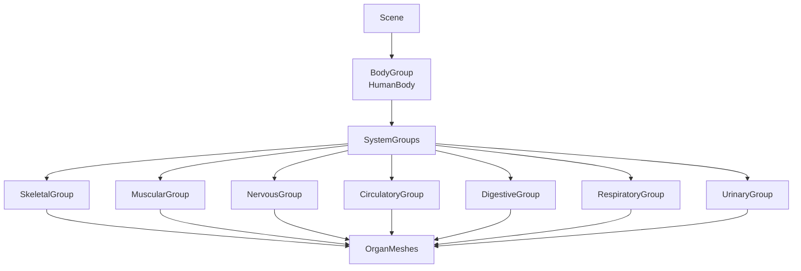
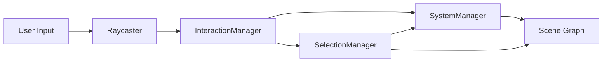
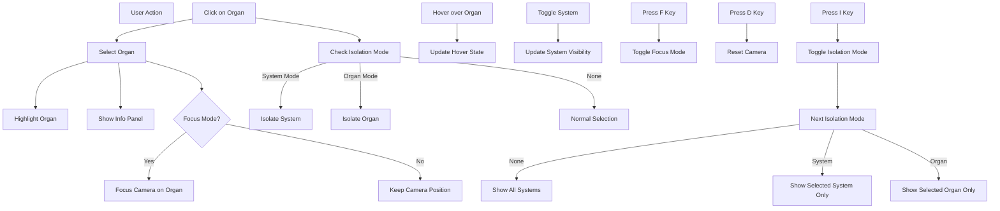
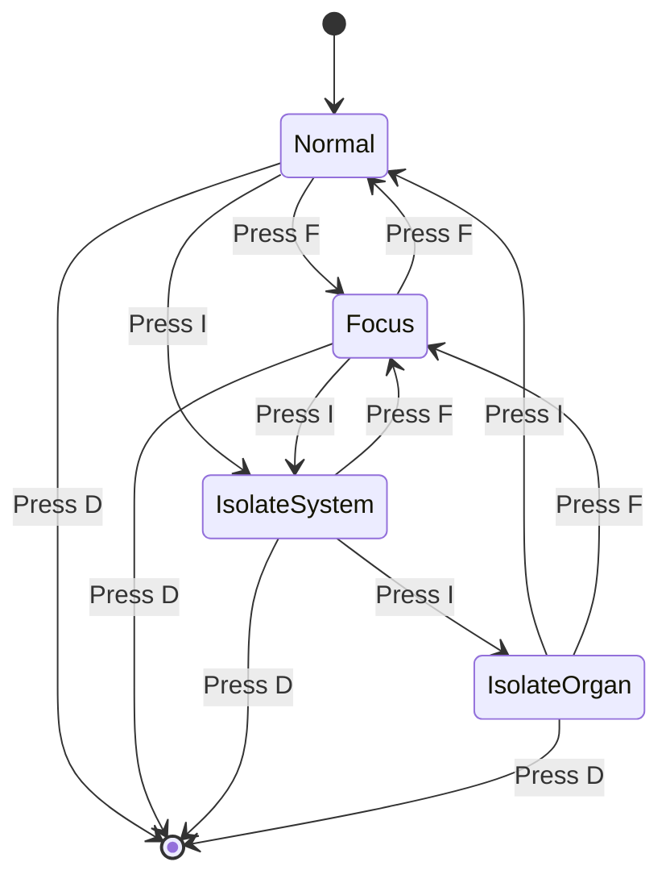
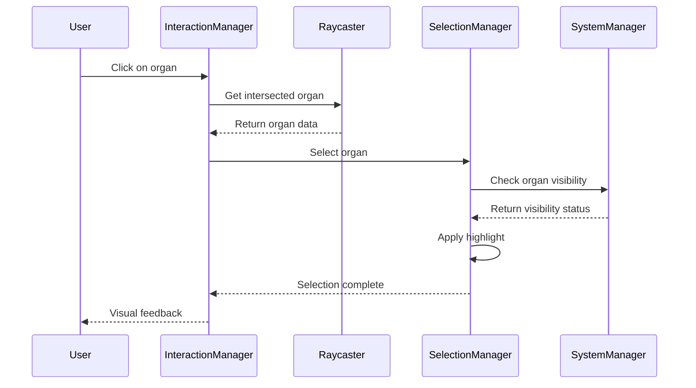
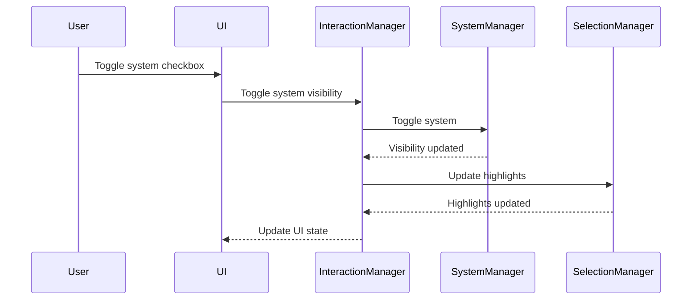

# Phase 2: Anatomy Interaction Layer - Technical Plan (Simplified)

## 📋 Overview

**Objective:** Improve anatomical exploration and interaction logic (not visuals).

**Scope:**
- Introduce body systems (skeletal, digestive, nervous, etc.)
- Organ-to-system mapping
- Ability to toggle systems on/off
- Organ grouping and isolation logic
- Clear interaction rules (select, focus, isolate)
- Hover feedback improvements
- Scene structure cleanup (groups/layers)
- Minor camera behavior refinements only if necessary

**Constraints:**
- Web only
- Three.js vanilla
- No backend
- No mobile
- No Micro/Nano
- No UI polish beyond functional controls
- Placeholder geometry is acceptable

**Architecture Principle:**
- Simple, predictable state logic
- ~3 core managers (not over-engineered)
- Highlight and visibility as internal responsibilities
- Maintainable and easy to understand

---

## 🏗️ Architecture Overview

### Scene Structure



### Data Flow



---

## 📊 Data Structures

### 1. Organ Data Schema (Extended from Phase 1)

```javascript
const ORGANS_DATA = [
  {
    id: 'heart',
    name: 'Heart',
    system: 'circulatory',
    function: 'Pumps blood throughout body',
    meshName: 'Heart',
    position: { x: 0.05, y: 0.35, z: 0.12 },
    color: 0xff4444,
    originalColor: null,
    geometry: 'sphere',
    size: 0.12,
    scale: { x: 1.2, y: 1.0, z: 1.0 },
    // NEW: System reference
    systemId: 'circulatory',
    // NEW: Group reference
    groupId: 'circulatory-organs',
    // NEW: Visibility state
    visible: true,
    // NEW: Opacity state
    opacity: 1.0
  },
  // ... more organs
];
```

### 2. Body System Data Schema

```javascript
const BODY_SYSTEMS = [
  {
    id: 'skeletal',
    name: 'Skeletal System',
    description: 'Provides structure, protection, and support',
    color: '#e0e0e0',
    organs: ['skull', 'spine', 'ribs', 'arms', 'legs', 'pelvis'],
    // NEW: Scene group reference
    group: null, // THREE.Group reference
    // NEW: Visibility state
    visible: true,
    // NEW: Opacity state
    opacity: 1.0
  },
  {
    id: 'muscular',
    name: 'Muscular System',
    description: 'Enables movement and maintains posture',
    color: '#ff6b6b',
    organs: ['biceps', 'triceps', 'quadriceps', 'hamstrings', 'abdominals'],
    group: null,
    visible: false, // Start hidden
    opacity: 1.0
  },
  {
    id: 'nervous',
    name: 'Nervous System',
    description: 'Controls and coordinates body activities',
    color: '#ffd93d',
    organs: ['brain', 'spinal-cord', 'nerves'],
    group: null,
    visible: true,
    opacity: 1.0
  },
  {
    id: 'circulatory',
    name: 'Circulatory System',
    description: 'Transports blood, nutrients, and oxygen',
    color: '#ff4757',
    organs: ['heart', 'arteries', 'veins', 'capillaries'],
    group: null,
    visible: true,
    opacity: 1.0
  },
  {
    id: 'digestive',
    name: 'Digestive System',
    description: 'Breaks down food and absorbs nutrients',
    color: '#ffa502',
    organs: ['stomach', 'intestines', 'liver', 'pancreas'],
    group: null,
    visible: true,
    opacity: 1.0
  },
  {
    id: 'respiratory',
    name: 'Respiratory System',
    description: 'Facilitates breathing and gas exchange',
    color: '#2ed573',
    organs: ['lungs', 'trachea', 'bronchi', 'diaphragm'],
    group: null,
    visible: true,
    opacity: 1.0
  },
  {
    id: 'urinary',
    name: 'Urinary System',
    description: 'Filters blood and removes waste',
    color: '#00cec9',
    organs: ['kidneys', 'bladder', 'ureters', 'urethra'],
    group: null,
    visible: true,
    opacity: 1.0
  }
];
```

### 3. Interaction State

```javascript
const INTERACTION_STATE = {
  // Selection
  selectedOrgan: null, // Organ object or null
  
  // Hover
  hoveredOrgan: null, // Organ object or null
  
  // Focus mode
  isFocusMode: false,
  
  // Isolation mode
  isolationMode: 'none', // 'none', 'system', 'organ'
  isolatedSystemId: null, // System ID or null
  isolatedOrganId: null, // Organ ID or null
  
  // System visibility
  visibleSystems: new Set(['skeletal', 'nervous', 'circulatory', 'digestive', 'respiratory', 'urinary']),
  
  // Camera state
  cameraPosition: null,
  cameraTarget: null,
  
  // Animation state
  isAnimating: false
};
```

---

## 🎯 Interaction Model

### Interaction Rules



### Interaction States

| State | Description | Behavior |
|-------|-------------|----------|
| **Normal** | Default viewing mode | All visible systems shown, normal selection |
| **Focus** | Camera focused on selected organ | Camera locked to organ, smooth transitions |
| **Isolate System** | Only one system visible | All other systems hidden, selected system highlighted |
| **Isolate Organ** | Only one organ visible | All other organs hidden, selected organ highlighted |

### Interaction Modes Cycle



---

## 🔧 Core Components (Simplified Architecture)

### 1. SystemManager

**Responsibilities:**
- Create and manage system groups in scene
- Map organs to systems
- Toggle system visibility and opacity
- Handle isolation modes (system/organ)
- Provide system and organ queries

**Key Methods:**
```javascript
class SystemManager {
  constructor(scene, organsData, systemsData);
  
  // Initialize all system groups
  initializeSystemGroups();
  
  // Create a system group
  createSystemGroup(systemData);
  
  // Add organ mesh to system group
  addOrganToSystem(organMesh, systemId);
  
  // Toggle system visibility
  toggleSystemVisibility(systemId, visible);
  
  // Set system opacity
  setSystemOpacity(systemId, opacity);
  
  // Isolate: show only one system, hide others
  isolateSystem(systemId);
  
  // Isolate: show only one organ, hide others
  isolateOrgan(organId);
  
  // Show all systems and organs
  showAll();
  
  // Get system group by ID
  getSystemGroup(systemId);
  
  // Get organ mesh by ID
  getOrganMesh(organId);
  
  // Get all organ meshes in a system
  getSystemOrgans(systemId);
  
  // Check if system is visible
  isSystemVisible(systemId);
  
  // Check if organ is visible
  isOrganVisible(organId);
}
```

### 2. SelectionManager

**Responsibilities:**
- Handle organ selection and deselection
- Manage hover state and feedback
- Apply highlight effects (selected/hovered)
- Handle selection in different interaction modes
- Restore original appearances

**Key Methods:**
```javascript
class SelectionManager {
  constructor(systemManager, interactionState);
  
  // Select an organ
  selectOrgan(organId);
  
  // Deselect current organ
  deselectOrgan();
  
  // Update hover state
  setHoveredOrgan(organId);
  
  // Clear hover state
  clearHover();
  
  // Apply highlight to organ (selected/hovered)
  highlightOrgan(organId, type); // type: 'selected' | 'hovered' | 'isolated'
  
  // Remove highlight from organ
  removeHighlight(organId);
  
  // Restore organ's original appearance
  restoreOriginal(organId);
  
  // Restore all organs to original appearance
  restoreAllOriginals();
  
  // Get selected organ
  getSelectedOrgan();
  
  // Get hovered organ
  getHoveredOrgan();
  
  // Check if organ is selectable (respects visibility and isolation)
  isOrganSelectable(organId);
  
  // Handle selection in isolation mode
  handleSelectionInIsolation(organId);
}
```

### 3. InteractionManager

**Responsibilities:**
- Coordinate all interactions between SystemManager and SelectionManager
- Handle user input (mouse clicks, hover, keyboard)
- Manage interaction state (mode, selection, isolation)
- Route events to appropriate managers
- Handle mode transitions (Normal/Focus/Isolation)

**Key Methods:**
```javascript
class InteractionManager {
  constructor(scene, camera, controls, organsData, systemsData);
  
  // Initialize all managers and event listeners
  initialize();
  
  // Handle click event
  handleClick(event);
  
  // Handle hover event
  handleHover(event);
  
  // Handle keyboard events
  handleKeyboard(event);
  
  // Toggle focus mode (F key)
  toggleFocusMode();
  
  // Toggle isolation mode cycle (I key): none -> system -> organ -> none
  toggleIsolationMode();
  
  // Reset to default (D key)
  resetToDefault();
  
  // Quick toggle system (1-7 keys)
  toggleSystemQuick(systemId);
  
  // Get current interaction mode
  getInteractionMode(); // 'normal' | 'focus' | 'isolate-system' | 'isolate-organ'
  
  // Get current interaction state
  getState();
  
  // Update interaction state
  updateState(newState);
}
```

### Architecture Summary

```
InteractionManager (Coordinator)
├── SystemManager (Scene & Visibility)
│   └── Manages: SystemGroups, OrganMeshes, Visibility, Opacity
└── SelectionManager (Selection & Highlight)
    └── Manages: Selection, Hover, Highlight Effects
```

**Key Design Principles:**
- **Single Responsibility:** Each manager has one clear purpose
- **Simple State:** Interaction state is centralized and predictable
- **Internal Logic:** Highlight and visibility are internal responsibilities
- **Easy to Extend:** New features can be added without major refactoring

---

## 🎨 Visual Feedback System

### Highlight States

| State | Color | Emissive | Opacity | Scale |
|-------|-------|----------|---------|-------|
| **Normal** | Original | 0x000000 | 1.0 | 1.0 |
| **Hovered** | System color | 0.2 | 1.0 | 1.05 |
| **Selected** | System color | 0.4 | 1.0 | 1.1 |
| **Isolated** | System color | 0.3 | 1.0 | 1.05 |
| **Hidden** | - | - | 0.0 | 1.0 |

### Hover Feedback Improvements

1. **Immediate visual response:**
   - Scale up slightly (1.05x)
   - Add emissive glow
   - Change cursor to pointer

2. **Tooltip/label:**
   - Show organ name on hover
   - Show system name
   - Position near cursor

3. **Smooth transitions:**
   - Animate scale changes
   - Fade in/out highlights
   - Use easing functions

---

## 📐 Scene Structure Cleanup

### New Scene Hierarchy

```
Scene
└── BodyGroup (THREE.Group)
    ├── SkeletalSystemGroup (THREE.Group)
    │   ├── SkullMesh
    │   ├── SpineMesh
    │   └── ...
    ├── MuscularSystemGroup (THREE.Group)
    │   ├── BicepsMesh
    │   ├── TricepsMesh
    │   └── ...
    ├── NervousSystemGroup (THREE.Group)
    │   ├── BrainMesh
    │   ├── SpinalCordMesh
    │   └── ...
    ├── CirculatorySystemGroup (THREE.Group)
    │   ├── HeartMesh
    │   ├── ArteriesMesh
    │   └── ...
    ├── DigestiveSystemGroup (THREE.Group)
    │   ├── StomachMesh
    │   ├── IntestinesMesh
    │   └── ...
    ├── RespiratorySystemGroup (THREE.Group)
    │   ├── LungsMesh
    │   ├── TracheaMesh
    │   └── ...
    └── UrinarySystemGroup (THREE.Group)
        ├── KidneysMesh
        └── ...
```

### Naming Conventions

- **System Groups:** `{systemId}SystemGroup` (e.g., `circulatorySystemGroup`)
- **Organ Meshes:** `{organId}Mesh` (e.g., `heartMesh`)
- **System Colors:** Use hex codes from BODY_SYSTEMS data

---

## 🎮 Keyboard Controls

| Key | Action | Description |
|-----|--------|-------------|
| **F** | Toggle Focus Mode | Focus camera on selected organ |
| **D** | Reset to Default | Reset camera and clear selection |
| **I** | Toggle Isolation Mode | Cycle through isolation modes |
| **1-7** | Quick Toggle System | Toggle specific system visibility |
| **Esc** | Cancel | Cancel current action/selection |

### Quick System Toggle Keys

| Key | System |
|-----|--------|
| 1 | Skeletal |
| 2 | Muscular |
| 3 | Nervous |
| 4 | Circulatory |
| 5 | Digestive |
| 6 | Respiratory |
| 7 | Urinary |

---

## 🖱️ Mouse Controls

| Action | Behavior |
|--------|----------|
| **Left Click + Drag** | Rotate camera |
| **Right Click + Drag** | Pan camera |
| **Scroll** | Zoom in/out |
| **Left Click on Organ** | Select organ (respects current mode) |
| **Hover on Organ** | Show hover feedback |

---

## 📊 UI Controls (Functional Only)

### System Toggle Panel

```html
<div id="system-controls">
  <h3>Body Systems</h3>
  <div class="system-toggle" data-system="skeletal">
    <input type="checkbox" id="skeletal-toggle" checked>
    <label for="skeletal-toggle">Skeletal</label>
  </div>
  <div class="system-toggle" data-system="muscular">
    <input type="checkbox" id="muscular-toggle">
    <label for="muscular-toggle">Muscular</label>
  </div>
  <!-- ... more systems -->
</div>
```

### Mode Indicator

```html
<div id="mode-indicator">
  <span id="current-mode">Normal Mode</span>
  <div class="mode-hint">Press F to focus, I to isolate</div>
</div>
```

### Selected Organ Info (Enhanced)

```html
<div id="selected-organ">
  <h3 id="organ-name">Heart</h3>
  <p><strong>System:</strong> <span id="organ-system">Circulatory</span></p>
  <p><strong>Function:</strong> <span id="organ-function">Pumps blood</span></p>
  <div class="related-systems">
    <strong>Related Systems:</strong>
    <span class="system-tag">Respiratory</span>
    <span class="system-tag">Nervous</span>
  </div>
</div>
```

---

## 🔍 Raycasting Improvements

### Enhanced Raycasting Logic

```javascript
class EnhancedRaycaster {
  constructor(scene, camera) {
    this.raycaster = new THREE.Raycaster();
    this.mouse = new THREE.Vector2();
    this.scene = scene;
    this.camera = camera;
  }
  
  // Get intersected organs (respects visibility)
  getIntersectedOrgans(event, visibleOnly = true) {
    this.updateMousePosition(event);
    this.raycaster.setFromCamera(this.mouse, this.camera);
    
    // Get all organ meshes
    const organMeshes = this.getOrganMeshes();
    
    // Check intersections
    const intersects = this.raycaster.intersectObjects(organMeshes, true);
    
    // Filter by visibility if needed
    if (visibleOnly) {
      return intersects.filter(intersect => 
        this.isMeshVisible(intersect.object)
      );
    }
    
    return intersects;
  }
  
  // Check if mesh is visible
  isMeshVisible(mesh) {
    // Check mesh visibility
    if (!mesh.visible) return false;
    
    // Check parent group visibility
    let parent = mesh.parent;
    while (parent) {
      if (!parent.visible) return false;
      parent = parent.parent;
    }
    
    // Check opacity
    if (mesh.material && mesh.material.opacity === 0) return false;
    
    return true;
  }
  
  // Update mouse position
  updateMousePosition(event) {
    this.mouse.x = (event.clientX / window.innerWidth) * 2 - 1;
    this.mouse.y = -(event.clientY / window.innerHeight) * 2 + 1;
  }
  
  // Get all organ meshes from scene
  getOrganMeshes() {
    const meshes = [];
    this.scene.traverse((object) => {
      if (object.isMesh && object.userData.organId) {
        meshes.push(object);
      }
    });
    return meshes;
  }
}
```

---

## 🎬 Camera Behavior Refinements

### Focus Mode Enhancements

1. **Smooth focus transitions:**
   - Use easing functions (ease-in-out cubic)
   - Animate both position and target
   - Cancel ongoing animations on new focus

2. **Focus distance calculation:**
   - Calculate based on organ size
   - Maintain minimum safe distance
   - Respect zoom limits

3. **Focus on isolated organ:**
   - If in isolation mode, focus on isolated organ
   - Adjust camera position for better view

### Reset Behavior

1. **Reset to default:**
   - Reset camera position to DEFAULT_CAMERA_POSITION
   - Reset target to DEFAULT_TARGET
   - Clear selection
   - Exit focus mode
   - Exit isolation mode
   - Restore all system visibility

---

## 🔄 State Management Flow

### Selection Flow



### System Toggle Flow



---

## 📝 Implementation Steps

### Step 1: Data Structure Updates
- [ ] Extend ORGANS_DATA with systemId and groupId
- [ ] Create BODY_SYSTEMS data structure
- [ ] Define INTERACTION_STATE object
- [ ] Create organ-to-system mapping

### Step 2: Scene Structure Refactoring
- [ ] Create BodyGroup as main container
- [ ] Create system groups for each body system
- [ ] Reorganize organ meshes into system groups
- [ ] Implement naming conventions
- [ ] Update raycasting to work with new structure

### Step 3: System Manager Implementation
- [ ] Implement SystemManager class
- [ ] Create system groups initialization
- [ ] Implement organ-to-system mapping
- [ ] Add system visibility toggle
- [ ] Add system opacity control
- [ ] Implement isolation modes (system/organ)
- [ ] Add visibility queries

### Step 4: Selection Manager Implementation
- [ ] Implement SelectionManager class
- [ ] Add organ selection logic
- [ ] Add hover state management
- [ ] Implement highlight effects (selected/hovered/isolated)
- [ ] Handle selection in different modes
- [ ] Implement selection state management
- [ ] Add original appearance restoration

### Step 5: Interaction Manager Implementation
- [ ] Implement InteractionManager class
- [ ] Coordinate SystemManager and SelectionManager
- [ ] Handle click events
- [ ] Handle hover events
- [ ] Handle keyboard events (F, D, I, 1-7)
- [ ] Implement mode transitions (Normal/Focus/Isolation)
- [ ] Manage interaction state

### Step 6: Raycasting Enhancements
- [ ] Implement EnhancedRaycaster class
- [ ] Add visibility filtering
- [ ] Improve hover detection
- [ ] Add intersection prioritization

### Step 7: UI Controls
- [ ] Create system toggle panel
- [ ] Add mode indicator
- [ ] Enhance selected organ info
- [ ] Add keyboard shortcuts display

### Step 8: Camera Refinements
- [ ] Enhance focus mode behavior
- [ ] Improve reset behavior
- [ ] Add focus distance calculation
- [ ] Implement smooth transitions

### Step 9: Testing and Refinement
- [ ] Test all interaction modes
- [ ] Test system toggling
- [ ] Test isolation modes
- [ ] Test hover feedback
- [ ] Refine based on testing

---

## 🎯 Success Criteria

### Functional Requirements
- [x] All body systems can be toggled on/off
- [x] Organs are properly mapped to systems
- [x] System isolation mode works correctly
- [x] Organ isolation mode works correctly
- [x] Focus mode works with selected organ
- [x] Hover feedback is clear and responsive
- [x] Scene structure is clean and organized
- [x] Keyboard controls work as specified
- [x] Mouse controls work as specified

### Technical Requirements
- [x] Three.js vanilla implementation
- [x] No backend dependencies
- [x] Placeholder geometry acceptable
- [x] Performance is acceptable
- [x] Code is clean and maintainable
- [x] Phase 1 behavior is preserved

### User Experience Requirements
- [x] Interactions are intuitive
- [x] Visual feedback is clear
- [x] Transitions are smooth
- [x] Controls are responsive
- [x] No confusing behaviors

---

## 🚀 Migration from Phase 1

### What Changes

1. **Data Structure:**
   - ORGANS_DATA: Add systemId and groupId fields
   - Add BODY_SYSTEMS constant
   - Add INTERACTION_STATE object

2. **Scene Structure:**
   - Wrap all organs in BodyGroup
   - Create system groups
   - Reorganize organ meshes

3. **Code Organization:**
   - Extract SystemManager class (includes visibility logic)
   - Extract SelectionManager class (includes highlight logic)
   - Extract InteractionManager class (coordinates both)

4. **Interaction Logic:**
   - Add system toggling
   - Add isolation modes
   - Enhance hover feedback
   - Improve raycasting

### What Stays the Same

1. **Phase 1 Core Features:**
   - Three.js scene setup
   - OrbitControls configuration
   - Camera focus animation
   - Basic organ selection
   - Keyboard shortcuts (F, D)
   - UI panels (info, selected organ)

2. **Phase 1 Behavior:**
   - Camera controls (rotate, pan, zoom)
   - Focus mode toggle (F key)
   - Reset to default (D key)
   - Organ selection highlighting
   - Info panel display

---

## 📚 File Structure

```
phase2-test/
├── index.html              # Updated with system controls
├── main.js                 # Main entry point
├── README.md               # Phase 2 documentation
└── src/
    ├── managers/
    │   ├── SystemManager.js
    │   ├── SelectionManager.js
    │   └── InteractionManager.js
    ├── utils/
    │   ├── EnhancedRaycaster.js
    │   └── AnimationUtils.js
    └── data/
        ├── organsData.js
        ├── systemsData.js
        └── interactionState.js
```

---

## 💡 Design Decisions

### Why This Architecture?

1. **Separation of Concerns:**
   - Each manager has a single responsibility
   - Easy to test and maintain
   - Clear code organization

2. **Extensibility:**
   - Easy to add new systems
   - Easy to add new interaction modes
   - Easy to add new visual feedback

3. **Performance:**
   - Efficient raycasting with visibility filtering
   - Smooth animations with proper cleanup
   - Minimal scene traversals

4. **User Experience:**
   - Clear visual feedback
   - Intuitive controls
   - Smooth transitions

### Trade-offs

1. **Complexity vs. Features:**
   - More managers = more code
   - But better organization and maintainability

2. **Performance vs. Visuals:**
   - Smooth animations require more computation
   - But better user experience

3. **Flexibility vs. Simplicity:**
   - Multiple interaction modes = more complexity
   - But richer exploration experience

---

## 🎓 Next Steps

After Phase 2 completion:

1. **Phase 3:** Advanced interactions
   - Multi-organ selection
   - System relationships visualization
   - Advanced camera behaviors

2. **Phase 4:** Content expansion
   - More organs
   - More systems
   - Detailed organ information

3. **Phase 5:** UI polish
   - Better visual design
   - Animations
   - Responsive design

---

## 📞 Questions for Review

1. **Interaction Model:**
   - Is the isolation mode cycle (none → system → organ → none) intuitive?
   - Should we add more interaction modes?

2. **System Selection:**
   - Are 7 body systems sufficient for Phase 2?
   - Should we start with fewer systems?

3. **Visual Feedback:**
   - Are the highlight states (color, emissive, opacity, scale) appropriate?
   - Should we add more visual feedback options?

4. **Controls:**
   - Are the keyboard shortcuts (F, D, I, 1-7) intuitive?
   - Should we add more shortcuts?

5. **Performance:**
   - Is the proposed architecture performant enough?
   - Should we add optimization strategies?

---

**End of Phase 2 Technical Plan**
