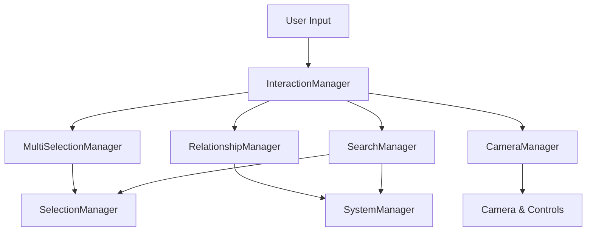
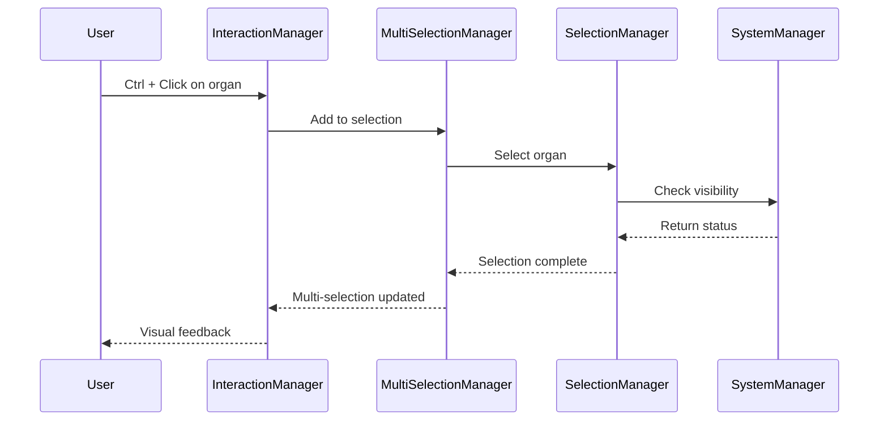
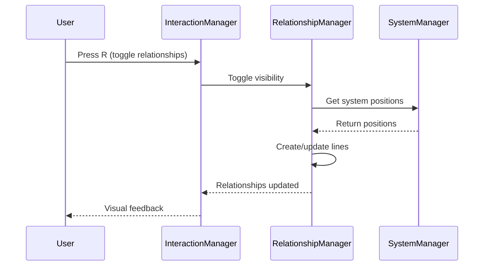
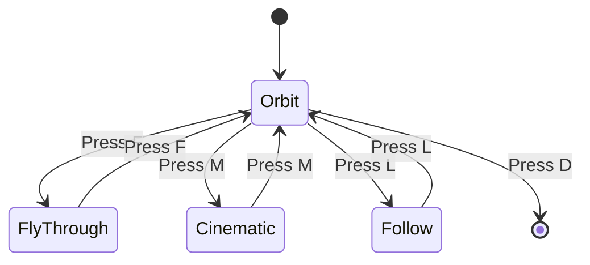

# Phase 3: Advanced Interactions - Technical Plan

## 📋 Overview

**Objective:** Expand interaction capabilities with multi-organ selection, system relationships visualization, advanced camera behaviors, enhanced search, and user authentication.

**Scope:**
- Multi-organ selection and batch operations
- Visual system relationships and connections
- Advanced camera behaviors (orbit, fly-through, cinematic)
- Enhanced search with filters and auto-complete
- User accounts and authentication system

**Constraints:**
- Web only (Phase 3 test environment)
- Build upon Phase 2 architecture
- Three.js vanilla implementation
- No backend for Phase 3 test (mock authentication)
- Placeholder geometry acceptable
- Focus on functionality over visuals

**Architecture Principle:**
- Extend existing 3-manager architecture
- Add new managers for advanced features
- Maintain Phase 2 behavior
- Keep state management simple and predictable

---

## 🏗️ Architecture Overview

### Extended Manager Architecture

```
InteractionManager (Coordinator)
├── SystemManager (Scene & Visibility)
│   └── Manages: SystemGroups, OrganMeshes, Visibility, Opacity
├── SelectionManager (Selection & Highlight)
│   └── Manages: Selection, Hover, Highlight Effects
├── MultiSelectionManager (NEW)
│   └── Manages: Multiple Organ Selection, Batch Operations
├── RelationshipManager (NEW)
│   └── Manages: System Connections, Visual Relationships
├── CameraManager (NEW)
│   └── Manages: Advanced Camera Behaviors, Transitions
└── SearchManager (NEW)
    └── Manages: Search, Filters, Auto-complete
```

### Data Flow



---

## 📊 Data Structures

### 1. Multi-Selection State (Extended)

```javascript
const MULTI_SELECTION_STATE = {
  // Multiple selected organs
  selectedOrgans: new Set(), // Set of organ IDs
  
  // Selection mode
  selectionMode: 'single', // 'single' | 'multi' | 'batch'
  
  // Selection bounds (for batch selection)
  selectionBounds: null, // Bounding box for selected organs
  
  // Batch operations
  batchOperation: null, // 'isolate' | 'hide' | 'highlight' | null
  
  // Selection history (for undo/redo)
  selectionHistory: [], // Array of selection states
  historyIndex: -1
};
```

### 2. System Relationships Data

```javascript
const SYSTEM_RELATIONSHIPS = [
  {
    from: 'circulatory',
    to: 'respiratory',
    type: 'strong',
    description: 'Oxygen exchange between blood and lungs',
    organs: ['heart', 'lungs']
  },
  {
    from: 'circulatory',
    to: 'nervous',
    type: 'medium',
    description: 'Blood supply to brain and nerves',
    organs: ['heart', 'brain']
  },
  {
    from: 'digestive',
    to: 'circulatory',
    type: 'strong',
    description: 'Nutrient absorption into blood',
    organs: ['stomach', 'intestines', 'heart']
  },
  {
    from: 'nervous',
    to: 'muscular',
    type: 'strong',
    description: 'Nerve impulses control muscles',
    organs: ['brain', 'spinal-cord', 'muscles']
  },
  {
    from: 'skeletal',
    to: 'muscular',
    type: 'strong',
    description: 'Muscles attach to bones for movement',
    organs: ['bones', 'muscles']
  },
  {
    from: 'urinary',
    to: 'circulatory',
    type: 'medium',
    description: 'Kidneys filter blood',
    organs: ['kidneys', 'heart']
  },
  {
    from: 'respiratory',
    to: 'skeletal',
    type: 'weak',
    description: 'Rib cage protects lungs',
    organs: ['ribs', 'lungs']
  }
];
```

### 3. Camera State (Extended)

```javascript
const CAMERA_STATE = {
  // Current camera mode
  cameraMode: 'orbit', // 'orbit' | 'fly-through' | 'cinematic' | 'follow'
  
  // Camera presets
  currentPreset: null, // 'front' | 'back' | 'left' | 'right' | 'top' | 'bottom'
  
  // Fly-through path
  flyPath: null, // Array of waypoints
  flyProgress: 0, // Current progress (0-1)
  isFlying: false,
  
  // Cinematic mode
  cinematicSequence: null, // Array of camera shots
  cinematicIndex: 0,
  isCinematic: false,
  
  // Follow mode
  followTarget: null, // Organ ID to follow
  followOffset: null, // Offset from target
  isFollowing: false,
  
  // Animation state
  isAnimating: false,
  animationType: null
};
```

### 4. Search State

```javascript
const SEARCH_STATE = {
  // Search query
  query: '',
  
  // Search filters
  filters: {
    system: null, // System ID or null
    location: null, // Body region or null
    function: null // Function keyword or null
  },
  
  // Search results
  results: [], // Array of matching organs
  highlightedResults: new Set(), // Currently highlighted results
  
  // Auto-complete
  suggestions: [], // Array of suggestions
  showSuggestions: false,
  selectedIndex: -1, // Currently selected suggestion
  
  // Search history
  history: [], // Array of recent searches
  maxHistory: 10
};
```

### 5. User State (Mock for Phase 3)

```javascript
const USER_STATE = {
  // Authentication
  isAuthenticated: false,
  user: null, // User object or null
  token: null, // JWT token (mock)
  
  // User preferences
  preferences: {
    theme: 'light', // 'light' | 'dark'
    language: 'en',
    cameraSpeed: 1.0,
    highlightIntensity: 0.4,
    autoSave: true
  },
  
  // User data
  savedSelections: [], // Saved multi-selection sets
  bookmarks: [], // Bookmarked organs
  notes: [], // User notes on organs
  progress: {} // Learning progress
};
```

---

## 🎯 Feature Specifications

### 1. Multi-Organ Selection

#### Selection Modes

| Mode | Description | Behavior |
|------|-------------|----------|
| **Single** | Select one organ at a time | Click to select, previous selection cleared |
| **Multi** | Select multiple organs | Ctrl/Cmd + Click to add/remove |
| **Batch** | Select multiple organs via area | Drag to select organs in area |

#### Multi-Selection Controls

| Key/Action | Description |
|------------|-------------|
| **Ctrl/Cmd + Click** | Add organ to selection |
| **Shift + Click** | Select range of organs |
| **Ctrl/Cmd + A** | Select all visible organs |
| **Esc** | Clear all selection |
| **Ctrl/Cmd + D** | Deselect all |
| **Ctrl/Cmd + I** | Invert selection |

#### Batch Operations

| Operation | Description |
|----------|-------------|
| **Isolate Selected** | Show only selected organs |
| **Hide Selected** | Hide selected organs |
| **Highlight Selected** | Apply highlight to all selected |
| **Save Selection** | Save current selection as preset |
| **Load Selection** | Load saved selection |

#### Visual Feedback

- Selected organs: Emissive glow (intensity 0.4)
- Multi-selection count badge in UI
- Selection bounds visualization (optional)
- Connection lines between selected organs (optional)

---

### 2. System Relationships Visualization

#### Relationship Types

| Type | Strength | Visual Representation |
|------|----------|----------------------|
| **Strong** | Critical connection | Thick, solid line, bright color |
| **Medium** | Important connection | Medium line, normal color |
| **Weak** | Minor connection | Thin, dashed line, dim color |

#### Visualization Features

- **Connection Lines:** Draw lines between related systems
- **Animated Flow:** Animated particles along connection lines
- **Hover Effects:** Highlight connections when hovering systems
- **Selection Effects:** Show connections for selected organs
- **Toggle Visibility:** Show/hide relationship lines

#### Relationship Controls

| Key/Action | Description |
|------------|-------------|
| **R** | Toggle relationship lines |
| **Shift + R** | Cycle relationship strength filter |
| **Click on Line** | Show relationship details |

#### Relationship Details Panel

```
┌─────────────────────────────────┐
│ Relationship Details           │
├─────────────────────────────────┤
│ From: Circulatory System        │
│ To: Respiratory System         │
│ Type: Strong Connection        │
│                                 │
│ Description:                    │
│ Oxygen exchange between blood   │
│ and lungs                       │
│                                 │
│ Related Organs:                 │
│ • Heart                         │
│ • Lungs                         │
└─────────────────────────────────┘
```

---

### 3. Advanced Camera Behaviors

#### Camera Modes

| Mode | Description | Controls |
|------|-------------|----------|
| **Orbit** | Standard orbit around target | Left drag to rotate, scroll to zoom |
| **Fly-Through** | Camera moves along predefined path | Auto-play or manual control |
| **Cinematic** | Camera follows scripted sequence | Auto-play |
| **Follow** | Camera follows selected organ | Auto-follow organ movement |

#### Camera Presets

| Preset | Description | Shortcut |
|--------|-------------|----------|
| **Front** | Front view of body | 1 |
| **Back** | Back view of body | 2 |
| **Left** | Left side view | 3 |
| **Right** | Right side view | 4 |
| **Top** | Top-down view | 5 |
| **Bottom** | Bottom-up view | 6 |

#### Fly-Through Features

- Predefined paths through body systems
- Smooth interpolation between waypoints
- Adjustable speed
- Pause/resume control
- Auto-rotate to look at organs

#### Cinematic Features

- Scripted camera sequences
- Multiple shots with transitions
- Fade in/out effects
- Voiceover support (placeholder)
- Timeline editor (future)

#### Camera Controls

| Key | Action |
|-----|--------|
| **C** | Toggle camera mode |
| **P** | Cycle camera presets |
| **F** | Toggle fly-through |
| **M** | Toggle cinematic mode |
| **L** | Toggle follow mode |
| **+/-** | Adjust camera speed |
| **Space** | Pause/resume animation |

---

### 4. Enhanced Search Functionality

#### Search Features

- **Real-time search:** Results update as you type
- **Auto-complete:** Suggest matching organs/systems
- **Filters:** Filter by system, location, function
- **Highlight:** Highlight search results in 3D view
- **History:** Recent searches
- **Saved searches:** Save frequently used searches

#### Search Syntax

| Syntax | Description | Example |
|--------|-------------|---------|
| `name` | Search by organ name | `heart` |
| `system:name` | Search by system | `system:circulatory` |
| `location:name` | Search by location | `location:chest` |
| `function:keyword` | Search by function | `function:pump` |
| `*` | Wildcard | `*artery*` |

#### Search UI

```
┌─────────────────────────────────────┐
│ 🔍 Search organs and systems       │
├─────────────────────────────────────┤
│ heart                               │
├─────────────────────────────────────┤
│ Filters:                            │
│ [System ▼] [Location ▼] [Func ▼]  │
├─────────────────────────────────────┤
│ Results (3):                         │
│ • Heart (Circulatory)               │
│ • Heart Chambers (Circulatory)       │
│ • Heart Valves (Circulatory)        │
├─────────────────────────────────────┤
│ History:                            │
│ lungs, brain, stomach                │
└─────────────────────────────────────┘
```

#### Search Controls

| Key | Action |
|-----|--------|
| **/** | Focus search input |
| **Tab** | Next suggestion |
| **Shift + Tab** | Previous suggestion |
| **Enter** | Select suggestion |
| **Esc** | Clear search |
| **Ctrl/Cmd + S** | Save search |

---

### 5. User Accounts and Authentication (Mock)

#### Authentication Features

- **Sign Up:** Create new account
- **Sign In:** Login with email/password
- **Sign Out:** Logout
- **Remember Me:** Stay logged in
- **Password Reset:** Reset password (mock)

#### User Preferences

- **Theme:** Light/Dark mode
- **Language:** Language selection
- **Camera Speed:** Adjust camera animation speed
- **Highlight Intensity:** Adjust highlight brightness
- **Auto-Save:** Toggle auto-save selections

#### User Data

- **Saved Selections:** Save and load multi-selection sets
- **Bookmarks:** Bookmark favorite organs
- **Notes:** Add notes to organs
- **Progress:** Track learning progress

#### Authentication UI

```
┌─────────────────────────────────┐
│ Sign In                         │
├─────────────────────────────────┤
│ Email:                          │
│ [user@example.com            ]  │
│                                 │
│ Password:                       │
│ [••••••••••••••••••••••••   ]  │
│                                 │
│ [☑] Remember me                 │
│                                 │
│ [Sign In]  [Forgot password?]   │
│                                 │
│ Don't have an account?          │
│ [Sign Up]                       │
└─────────────────────────────────┘
```

#### Authentication Controls (Mock)

- All authentication is client-side only
- User data stored in localStorage
- No backend API calls
- Perfect for testing UI/UX

---

## 🔧 Core Components (Extended Architecture)

### 1. MultiSelectionManager (NEW)

**Responsibilities:**
- Manage multiple organ selection
- Handle batch operations
- Track selection history
- Provide selection utilities

**Key Methods:**
```javascript
class MultiSelectionManager {
  constructor(systemManager, selectionManager, interactionState);
  
  // Select multiple organs
  selectMultiple(organIds);
  
  // Add organ to selection
  addToSelection(organId);
  
  // Remove organ from selection
  removeFromSelection(organId);
  
  // Clear all selection
  clearSelection();
  
  // Invert selection
  invertSelection();
  
  // Select all visible organs
  selectAll();
  
  // Batch operations
  isolateSelected();
  hideSelected();
  highlightSelected();
  
  // Save/Load selections
  saveSelection(name);
  loadSelection(name);
  deleteSelection(name);
  
  // Selection history
  undo();
  redo();
  
  // Get selection info
  getSelectedOrgans();
  getSelectionCount();
  getSelectionBounds();
  
  // Selection mode
  setSelectionMode(mode);
  getSelectionMode();
}
```

### 2. RelationshipManager (NEW)

**Responsibilities:**
- Manage system relationships
- Visualize connections
- Handle relationship interactions
- Provide relationship queries

**Key Methods:**
```javascript
class RelationshipManager {
  constructor(scene, systemManager, relationshipsData);
  
  // Initialize relationship lines
  initializeRelationships();
  
  // Create connection line
  createConnection(fromSystem, toSystem, type);
  
  // Update connection lines
  updateConnections();
  
  // Toggle relationship visibility
  toggleRelationships(visible);
  
  // Filter by strength
  filterByStrength(strength);
  
  // Highlight relationships
  highlightRelationships(organId);
  
  // Clear highlights
  clearHighlights();
  
  // Get relationships
  getRelationships(organId);
  getSystemRelationships(systemId);
  
  // Animate flow
  startFlowAnimation();
  stopFlowAnimation();
}
```

### 3. CameraManager (NEW)

**Responsibilities:**
- Manage advanced camera behaviors
- Handle camera modes
- Control camera animations
- Provide camera utilities

**Key Methods:**
```javascript
class CameraManager {
  constructor(camera, controls, scene);
  
  // Camera modes
  setCameraMode(mode);
  getCameraMode();
  
  // Camera presets
  setPreset(preset);
  cyclePresets();
  
  // Fly-through
  startFlyThrough(path);
  stopFlyThrough();
  pauseFlyThrough();
  resumeFlyThrough();
  setFlySpeed(speed);
  
  // Cinematic
  startCinematic(sequence);
  stopCinematic();
  nextShot();
  previousShot();
  
  // Follow mode
  startFollow(organId);
  stopFollow();
  setFollowOffset(offset);
  
  // Camera animation
  animateTo(position, target, duration);
  animateOrbit(angle, duration);
  
  // Camera utilities
  getCurrentPosition();
  getCurrentTarget();
  getDistanceTo(target);
}
```

### 4. SearchManager (NEW)

**Responsibilities:**
- Handle search queries
- Provide auto-complete
- Manage search filters
- Track search history

**Key Methods:**
```javascript
class SearchManager {
  constructor(organsData, systemsData);
  
  // Search
  search(query, filters);
  searchBySystem(systemId);
  searchByLocation(location);
  searchByFunction(keyword);
  
  // Auto-complete
  getSuggestions(query);
  selectSuggestion(index);
  
  // Filters
  setFilters(filters);
  clearFilters();
  getActiveFilters();
  
  // Results
  getResults();
  highlightResults();
  clearHighlights();
  
  // History
  addToHistory(query);
  getHistory();
  clearHistory();
  
  // Saved searches
  saveSearch(name, query, filters);
  loadSearch(name);
  deleteSearch(name);
  getSavedSearches();
}
```

### 5. AuthManager (NEW - Mock)

**Responsibilities:**
- Handle authentication (mock)
- Manage user preferences
- Store user data
- Provide user utilities

**Key Methods:**
```javascript
class AuthManager {
  constructor();
  
  // Authentication
  signUp(email, password);
  signIn(email, password);
  signOut();
  resetPassword(email);
  
  // User data
  loadUser();
  saveUser(user);
  updateUser(updates);
  
  // Preferences
  loadPreferences();
  savePreferences(preferences);
  updatePreference(key, value);
  
  // User data
  saveSelection(name, organIds);
  loadSelection(name);
  deleteSelection(name);
  getSavedSelections();
  
  addBookmark(organId);
  removeBookmark(organId);
  getBookmarks();
  
  addNote(organId, note);
  updateNote(organId, note);
  deleteNote(organId);
  getNotes(organId);
  
  // Utilities
  isAuthenticated();
  getCurrentUser();
  hasPermission(permission);
}
```

---

## 🎮 Keyboard Controls (Extended)

### Multi-Selection

| Key | Action | Description |
|-----|--------|-------------|
| **Ctrl/Cmd + Click** | Add to selection | Add organ to multi-selection |
| **Shift + Click** | Select range | Select range of organs |
| **Ctrl/Cmd + A** | Select all | Select all visible organs |
| **Ctrl/Cmd + D** | Deselect all | Clear all selection |
| **Ctrl/Cmd + I** | Invert selection | Invert current selection |
| **Ctrl/Cmd + S** | Save selection | Save current selection |
| **Ctrl/Cmd + L** | Load selection | Load saved selection |

### Relationships

| Key | Action | Description |
|-----|--------|-------------|
| **R** | Toggle relationships | Show/hide relationship lines |
| **Shift + R** | Filter strength | Cycle relationship strength filter |
| **Ctrl/Cmd + R** | Clear highlights | Clear relationship highlights |

### Camera

| Key | Action | Description |
|-----|--------|-------------|
| **C** | Toggle camera mode | Cycle camera modes |
| **P** | Cycle presets | Cycle camera presets |
| **F** | Toggle fly-through | Start/stop fly-through |
| **M** | Toggle cinematic | Start/stop cinematic mode |
| **L** | Toggle follow | Start/stop follow mode |
| **1-6** | Set preset | Set camera preset (front/back/left/right/top/bottom) |
| **+/-** | Adjust speed | Adjust camera animation speed |
| **Space** | Pause/Resume | Pause/resume camera animation |

### Search

| Key | Action | Description |
|-----|--------|-------------|
| **/** | Focus search | Focus search input |
| **Tab** | Next suggestion | Select next auto-complete suggestion |
| **Shift + Tab** | Previous suggestion | Select previous suggestion |
| **Enter** | Select suggestion | Select highlighted suggestion |
| **Esc** | Clear search | Clear search query and results |
| **Ctrl/Cmd + S** | Save search | Save current search |

### General

| Key | Action | Description |
|-----|--------|-------------|
| **F** | Toggle focus mode | Focus camera on selected organ |
| **D** | Reset to default | Reset camera and clear selection |
| **I** | Toggle isolation mode | Cycle isolation modes |
| **1-7** | Toggle system | Toggle system visibility |
| **Esc** | Cancel | Cancel current action |

---

## 📐 Scene Structure (Extended)

### New Scene Groups

```
Scene
└── BodyGroup (THREE.Group)
    ├── SystemGroups (from Phase 2)
    │   ├── SkeletalSystemGroup
    │   ├── MuscularSystemGroup
    │   ├── NervousSystemGroup
    │   ├── CirculatorySystemGroup
    │   ├── DigestiveSystemGroup
    │   ├── RespiratorySystemGroup
    │   └── UrinarySystemGroup
    │       └── OrganMeshes
    └── RelationshipsGroup (NEW)
        ├── ConnectionLines (THREE.Line)
        ├── FlowParticles (THREE.Points)
        └── RelationshipMarkers (THREE.Mesh)
```

---

## 🔄 State Management Flow (Extended)

### Multi-Selection Flow



### Relationship Visualization Flow



### Camera Mode Transition Flow



---

## 📝 Implementation Steps

### Step 1: Data Structure Updates
- [ ] Extend INTERACTION_STATE with multi-selection
- [ ] Create MULTI_SELECTION_STATE object
- [ ] Create SYSTEM_RELATIONSHIPS data
- [ ] Create CAMERA_STATE object
- [ ] Create SEARCH_STATE object
- [ ] Create USER_STATE object (mock)

### Step 2: Multi-Selection Manager Implementation
- [ ] Implement MultiSelectionManager class
- [ ] Add multi-selection logic
- [ ] Implement batch operations
- [ ] Add selection history
- [ ] Implement save/load selections
- [ ] Add selection utilities

### Step 3: Relationship Manager Implementation
- [ ] Implement RelationshipManager class
- [ ] Create connection lines
- [ ] Implement relationship visualization
- [ ] Add flow animation
- [ ] Implement relationship queries
- [ ] Add interaction handling

### Step 4: Camera Manager Implementation
- [ ] Implement CameraManager class
- [ ] Add camera modes
- [ ] Implement camera presets
- [ ] Add fly-through functionality
- [ ] Implement cinematic mode
- [ ] Add follow mode
- [ ] Implement camera animations

### Step 5: Search Manager Implementation
- [ ] Implement SearchManager class
- [ ] Add search logic
- [ ] Implement auto-complete
- [ ] Add filters
- [ ] Implement search history
- [ ] Add saved searches

### Step 6: Auth Manager Implementation (Mock)
- [ ] Implement AuthManager class (mock)
- [ ] Add authentication UI
- [ ] Implement user preferences
- [ ] Add user data storage
- [ ] Implement save/load user data

### Step 7: UI Updates
- [ ] Create multi-selection UI
- [ ] Create relationship controls UI
- [ ] Create camera controls UI
- [ ] Create search UI
- [ ] Create authentication UI
- [ ] Update existing UI for new features

### Step 8: Integration with Phase 2
- [ ] Integrate new managers with InteractionManager
- [ ] Update keyboard controls
- [ ] Update mouse controls
- [ ] Update interaction flows
- [ ] Ensure Phase 2 behavior is preserved

### Step 9: Testing and Refinement
- [ ] Test multi-selection
- [ ] Test relationships visualization
- [ ] Test camera modes
- [ ] Test search functionality
- [ ] Test authentication (mock)
- [ ] Refine based on testing

---

## 🎯 Success Criteria

### Functional Requirements

#### Multi-Selection
- [ ] Multiple organs can be selected simultaneously
- [ ] Batch operations work correctly
- [ ] Selection history works (undo/redo)
- [ ] Save/load selections work
- [ ] Keyboard shortcuts work as specified

#### Relationships
- [ ] Relationship lines display correctly
- [ ] Flow animation works smoothly
- [ ] Relationship filtering works
- [ ] Hover effects work
- [ ] Toggle visibility works

#### Camera
- [ ] All camera modes work correctly
- [ ] Camera presets work
- [ ] Fly-through works smoothly
- [ ] Cinematic mode works
- [ ] Follow mode works
- [ ] Camera animations are smooth

#### Search
- [ ] Real-time search works
- [ ] Auto-complete works
- [ ] Filters work correctly
- [ ] Search history works
- [ ] Saved searches work
- [ ] Search highlighting works

#### Authentication (Mock)
- [ ] Sign up works
- [ ] Sign in works
- [ ] Sign out works
- [ ] User preferences persist
- [ ] User data saves/loads

### Technical Requirements
- [ ] Three.js vanilla implementation
- [ ] No backend dependencies
- [ ] Placeholder geometry acceptable
- [ ] Performance is acceptable
- [ ] Code is clean and maintainable
- [ ] Phase 2 behavior is preserved

### User Experience Requirements
- [ ] Interactions are intuitive
- [ ] Visual feedback is clear
- [ ] Transitions are smooth
- [ ] Controls are responsive
- [ ] No confusing behaviors

---

## 🚀 Migration from Phase 2

### What Changes

1. **New Managers:**
   - Add MultiSelectionManager
   - Add RelationshipManager
   - Add CameraManager
   - Add SearchManager
   - Add AuthManager (mock)

2. **Extended State:**
   - Add MULTI_SELECTION_STATE
   - Add CAMERA_STATE
   - Add SEARCH_STATE
   - Add USER_STATE
   - Add SYSTEM_RELATIONSHIPS data

3. **Scene Structure:**
   - Add RelationshipsGroup
   - Add connection lines
   - Add flow particles

4. **UI Updates:**
   - Add multi-selection controls
   - Add relationship controls
   - Add camera controls
   - Add search UI
   - Add authentication UI

5. **Interaction Logic:**
   - Add multi-selection logic
   - Add relationship visualization
   - Add advanced camera behaviors
   - Add search functionality
   - Add user authentication (mock)

### What Stays the Same

1. **Phase 2 Core Features:**
   - All Phase 2 functionality preserved
   - SystemManager unchanged
   - SelectionManager unchanged (extended only)
   - InteractionManager unchanged (coordinator only)

2. **Phase 2 Behavior:**
   - Single organ selection still works
   - System toggling still works
   - Focus mode still works
   - Isolation modes still work
   - All Phase 2 keyboard shortcuts still work

---

## 📚 File Structure

```
phase3-test/
├── index.html              # Updated with new UI controls
├── main.js                 # Main entry point
├── README.md               # Phase 3 documentation
└── src/
    ├── managers/
    │   ├── SystemManager.js (from Phase 2)
    │   ├── SelectionManager.js (from Phase 2)
    │   ├── InteractionManager.js (from Phase 2, extended)
    │   ├── MultiSelectionManager.js (NEW)
    │   ├── RelationshipManager.js (NEW)
    │   ├── CameraManager.js (NEW)
    │   ├── SearchManager.js (NEW)
    │   └── AuthManager.js (NEW, mock)
    ├── utils/
    │   ├── EnhancedRaycaster.js (from Phase 2)
    │   ├── AnimationUtils.js (from Phase 2, extended)
    │   ├── CameraUtils.js (NEW)
    │   └── SearchUtils.js (NEW)
    └── data/
        ├── organsData.js (from Phase 2, extended)
        ├── systemsData.js (from Phase 2)
        ├── interactionState.js (from Phase 2, extended)
        ├── multiSelectionState.js (NEW)
        ├── systemRelationships.js (NEW)
        ├── cameraState.js (NEW)
        ├── searchState.js (NEW)
        └── userState.js (NEW, mock)
```

---

## 💡 Design Decisions

### Why This Architecture?

1. **Extensibility:**
   - New managers can be added without affecting existing ones
   - Each manager has a single responsibility
   - Easy to test and maintain

2. **Performance:**
   - Relationship lines only rendered when needed
   - Flow animation uses efficient particle system
   - Camera animations use requestAnimationFrame

3. **User Experience:**
   - Clear visual feedback for all interactions
   - Intuitive keyboard shortcuts
   - Smooth transitions between modes

4. **Phase 2 Compatibility:**
   - All Phase 2 features preserved
   - New features are additive, not replacing
   - Existing code can be reused

### Trade-offs

1. **Complexity vs. Features:**
   - More managers = more code
   - But better organization and maintainability

2. **Performance vs. Visuals:**
   - Relationship lines and flow particles add overhead
   - But can be toggled off for performance

3. **Mock Authentication vs. Real Backend:**
   - Mock authentication is not secure
   - But perfect for testing UI/UX before backend

---

## 🎓 Next Steps

After Phase 3 completion:

1. **Phase 4:** Content Expansion
   - More organs
   - More systems
   - Detailed organ information

2. **Phase 5:** UI Polish
   - Better visual design
   - Animations
   - Responsive design

3. **Integration:**
   - Integrate Phase 3 into main web application
   - Add real backend for authentication
   - Replace placeholder geometry with real models

---

## 📞 Questions for Review

1. **Multi-Selection:**
   - Is the selection mode cycle (single → multi → batch) intuitive?
   - Should we add more batch operations?

2. **Relationships:**
   - Are the 7 system relationships sufficient?
   - Should we add more relationship types?

3. **Camera:**
   - Are the camera modes (orbit, fly-through, cinematic, follow) sufficient?
   - Should we add more camera presets?

4. **Search:**
   - Is the search syntax intuitive?
   - Should we add more filters?

5. **Authentication:**
   - Should we implement real backend for Phase 3?
   - Or keep it mock for testing?

---

**End of Phase 3 Technical Plan**
